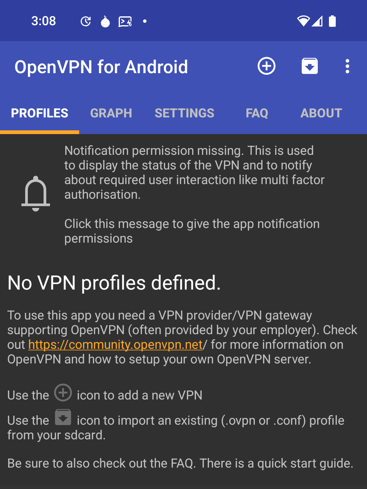
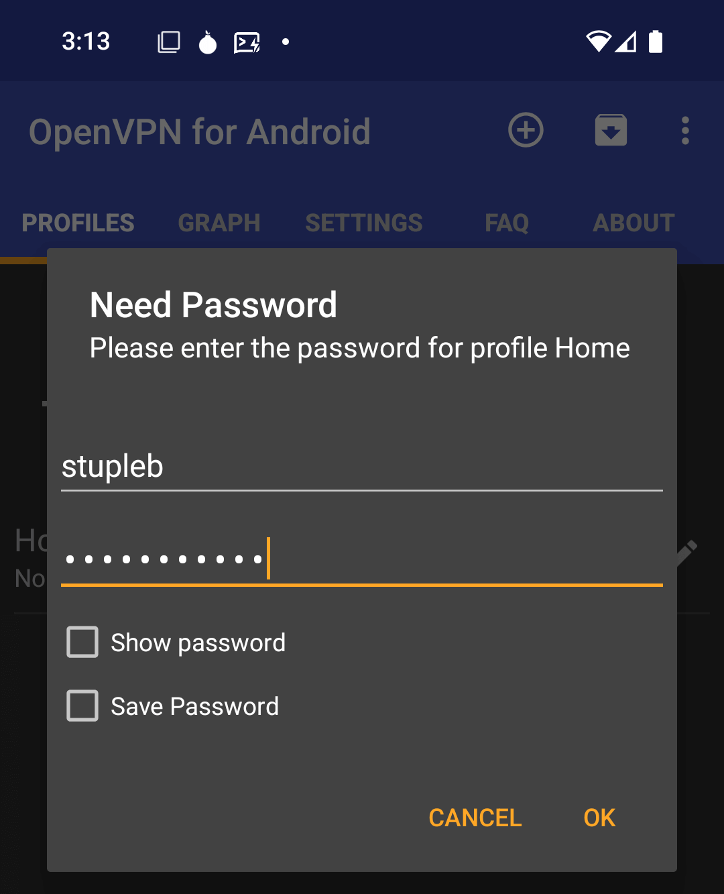
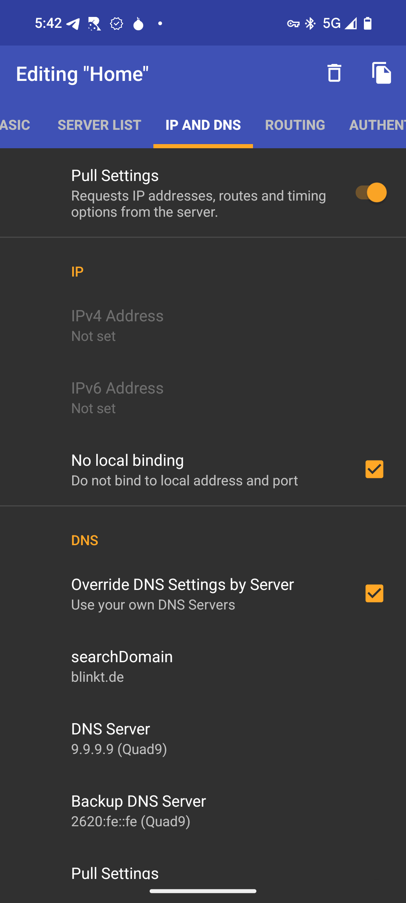

# Connecting via Router VPN (Android/Graphene)

Follow this guide to connect your Android/Graphene device to your Router VPN in order to access your StartOS server and installed services.

#### Prerequisites

- [Connecting Remotely - Router VPN](../../user-manual/connecting-remotely/vpn.md)

#### Contents

- [WireGuard](#wireguard)
- [OpenVPN](#openvpn)

## WireGuard

1. In your router's WireGuard server, create a new profile/configuration for your Andoid/Graphene device.

   

1. Install Wireguard from the <a href="https://play.google.com/store/apps/details?id=com.wireguard.android" target="_blank">Play Store</a> [WireGuard website](https://www.wireguard.com/install/)

   

1. Click the `+` button to add a new profile/connection.

   

1. Import the configuration file created above to your Android/Graphene device. If the configuration file can be displayed as a QR code, that is usually easiest. If not, you can download the file and transfer it to your Android/Graphene device. A last resort option would be to manually enter the necessary values.

   

1. Android will inform you that Wireguard wants to set up a VPN connection. Click "OK".

## OpenVPN

1. Install **OpenVPN for Android** from [Google Play](https://play.google.com/store/apps/details?id=de.blinkt.openvpn), [F-Droid](https://github.com/schwabe/ics-openvpn) or the APK from [Arne Schwabe's Github](https://github.com/schwabe/ics-openvpn). As an alternative you can also use **OpenVPN Connect** from [OpenVPN, Inc.](https://openvpn.net/client/).

1. Download the configuration file from your router's OpenVPN server to your Android/Graphene device. If accessing your router UI via a laptop/desktop, you will need to download the file to that device, then send it to yourself via email, message, or other file sharing tool.

   

1. Click the `+` button to add a new profile/connection.

   

1. Import from the file you downloaded above. Consider giving the profile a better name.

   

1. Android will inform you that OpenVPN wants to set up a VPN connection. Click "OK".

1. If you set up your OpenVPN server with username and password authentication, enter those and select to Save Password.

   

   ```admonish note
   In this guide we are using Password-only, but passwords can be accompanied by certificates for added security.
   ```

1. Once set up, click on the name of the profile allows you to connect and disconnect. You can edit the profile from the icon to its right.

   

1. If you're not able to browse websites when connected, your Router VPN may not be providing valid DNS servers. If so, edit the profile and visit the IP and DNS tab. Click to override the DNS settings and add your own.

   
