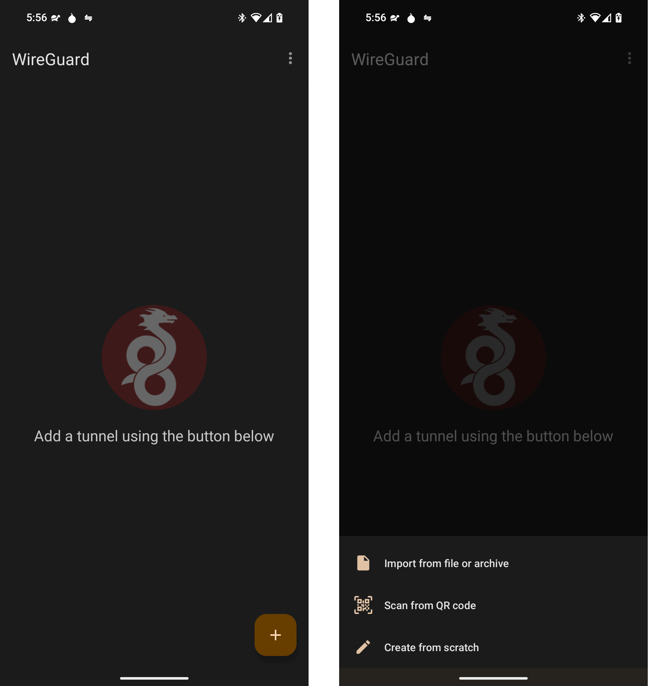

# Using a VPN (Android/Graphene)

## Prerequisites
Most modern routers have VPN functionality built-in. You'll need to configure your router to assign a static IP to your Start9 server and to setup a OpenVPN or Wireguard server on your router, depending on which it supports.

## OpenVPN

Slightly slower, but with more authentication options, including individual users.

### Automatic
### Manual


## Wireguard

Simpler and faster, its limitation is that it only authenticates with keys rather than usernames and passwords.

### Automatic

1. On your Android device, install the Wireguard client from Google Play or the APK from [Wireguard](https://www.wireguard.com/install/). You'll use this to read and automatically add your VPN configuration from your server into Android. You'll also use it as you would a typical VPN client app to easily connect and disconnect from your Router VPN server as you would from a third-party VPN server.

    

1. Download the configuration file from your router's VPN server to your device (or if applicable, display a QR code)

    

1. Add a new tunnel from the file downloaded to your device (or scan the QR code) by clicking on the '+'

    

1. Android will inform you that Wireguard wants to set up a VPN connection. Click 'OK'.

1. Your VPN tunnel will have been created and visible in both Android's system menus and conveniently in the Wireguard app where there is a quick toggle.

```admonish tip
In GrapheneOS, all VPNs are set to be always-on by default. You may need to go into your VPN settings and deactivate this if you want to have connectivity while not connected to your Router VPN.


```


### Manual

1. On your Android device, install the Wireguard client from Google Play or the APK from [Wireguard](https://www.wireguard.com/install/). You'll use this to read and automatically add your VPN configuration from your server into Android. You'll also use it as you would a typical VPN client app to easily connect and disconnect from your Router VPN server as you would from a third-party VPN server.

1. View the configuration from your router's VPN server with your client device in hand.

    

1. Add an interface and manually add the address, private key, DNS and MTU details provided by your router.

    

1. Click to Add Peer then add the public key, endpoint, keep alive and allowed IPs provided by your router.

1. Android will inform you that Wireguard wants to set up a VPN connection. Click 'OK'.

1. Your VPN tunnel will have been created and visible in both Android's system menus and conveniently in the Wireguard app where there is a quick toggle.