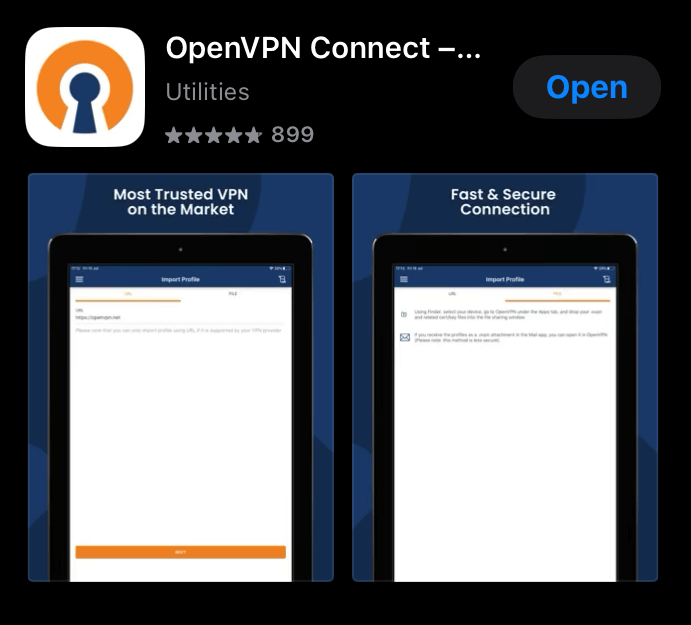
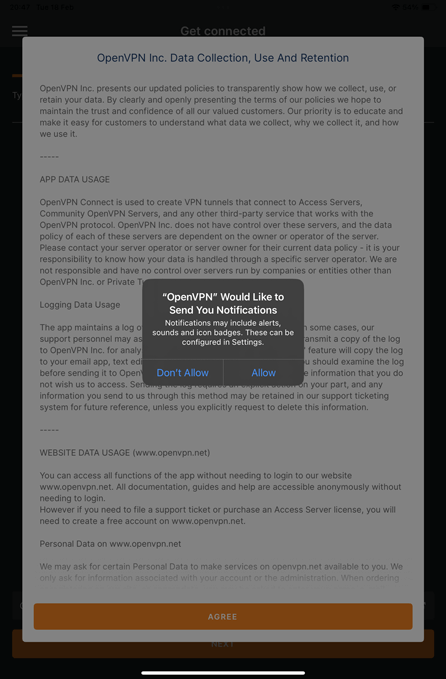
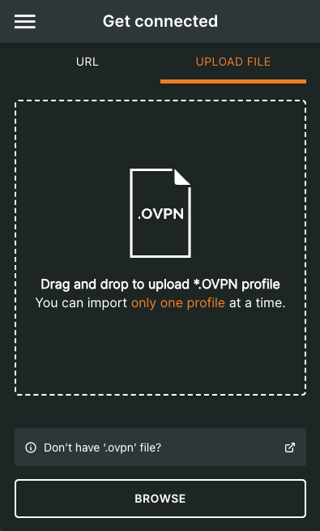
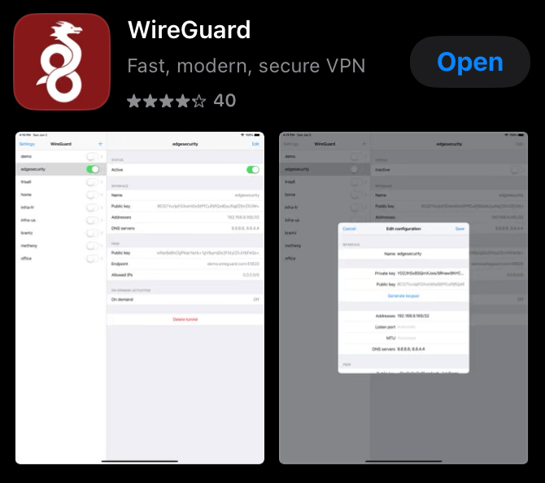
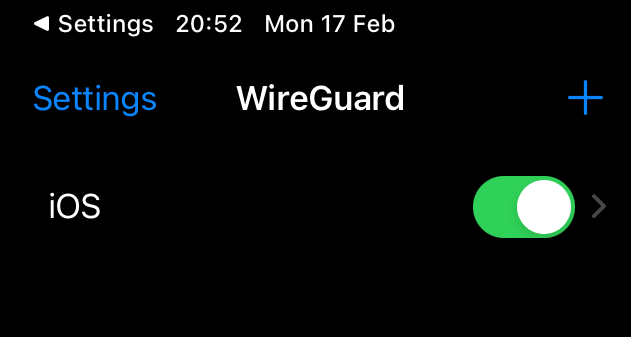

# Connecting over Router VPN (iOS)

#### Contents
- [OpenVPN](#openvpn)
- [WireGuard](#wireguard)

## Prerequisites
Most modern routers have VPN functionality built-in. You'll need to configure your router to assign a static IP to your Start9 server and to setup a OpenVPN or WireGuard server on your router, depending on which it supports.

The VPN client you set up will allow you to import your VPN configuration from your Router VPN server. You'll also use the client to easily connect and disconnect from your Router VPN server just like you would a comercial VPN app to a third-party VPN server.

## OpenVPN

Slightly slower, but with more authentication options, including creation of individual users with passwords.

1. On your iPhone or iPad, install the OpenVPN Connect client from the [App Store](https://itunes.apple.com/us/app/openvpn-connect/id590379981?mt=8). 

    

1. Click to accept notifications, accept terms etc.

    

1. Download the configuration file from your router's VPN server to your device

    

1. Import the configuration file and enter the necessary authentication settings you chose or were default on your OpenVPN Server on your router

    

1. Depending on how you've configured your OpenVPN server, you may need to add a username and password before you hit Connect.

    

1. Once set up, click on the name of the profile allows you to connect and disconnect. You can edit the profile from the icon to its right.

    

## WireGuard

Simpler and faster, its limitation is that it authenticates with keys rather than usernames and passwords (which might be easier to distribute to family/friends or others you share access to). You would create a WireGuard profile on your router's WireGuard Server for each device you want to connect to the VPN and follow the guide below on each device, importing the profile you created for that device.

1. On your iPhone or iPad, install the WireGuard client from the [App Store](https://itunes.apple.com/us/app/wireguard/id1441195209?ls=1&mt=8). 

    

1. Download the configuration file from your router's VPN server to your device (or if supported, generate a QR code and open it on another device).

    

1. Open WireGuard and create a new tunnel by importing the file downloaded to your device or scanning the QR by clicking 'Add a tunnel'

    

    

1. Your VPN tunnel will have been created and visible in the WireGuard app where you can click to activate it.

    

