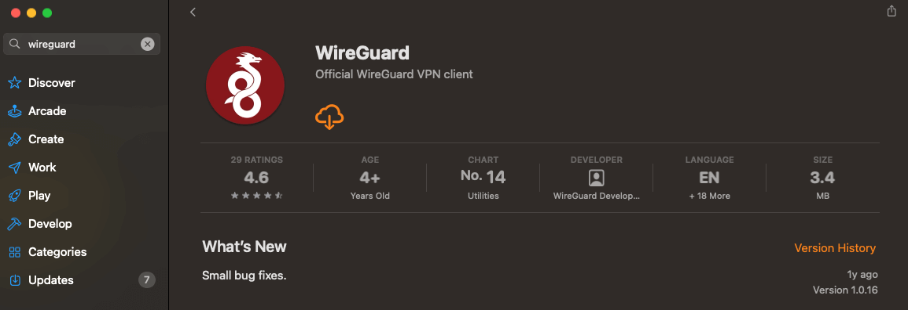

# Connecting via Router VPN (Mac)

Follow this guide to connect your Mac device to your Router VPN in order to access your StartOS server and installed services.

#### Prerequisites

- [Connecting Remotely - Router VPN](../../user-manual/connecting-remotely/vpn.md)

#### Contents

- [WireGuard](#wireguard)
- [OpenVPN](#openvpn)

## WireGuard

1. In your router's WireGuard server, create a new profile/configuration for your Mac. Download the configuration file.

   

1. Install WireGuard from the [App Store](https://apps.apple.com/us/app/wireguard/id1451685025).

   

1. Click "Import tunnel(s) from file" and select the file you downloaded above.

   

1. MacOS will inform you that WireGuard wants to set up a VPN connection. Click 'Allow'.

   

1. Your VPN tunnel will have been created and visible in both you Mac's system settings and conveniently in the WireGuard app where you can click to activate it.

   

   ```admonish tip
   You may need to edit your newly created tunnel and enable 'On-demand' for either ethernet, wifi or both.
   ```

## OpenVPN

1. Download and install the OpenVPN Connect client from the [official website](https://openvpn.net/client-connect-vpn-for-mac-os/).

   

1. If asked to do so, allow the OpenVPN client to run in the background.

   

1. Download the configuration file from your router's OpenVPN server.

   

1. Import the configuration file and enter the necessary authentication settings you chose or were default on your OpenVPN Server on your router

   

1. Depending on how you've configured your OpenVPN server, you may need to add a username and password before you hit Connect.

   

1. Once set up, click on the name of the profile allows you to connect and disconnect. You can edit the profile from the icon to its right.

   

   ```admonish note
   You can avoid using the OpenVPN Connect client and create the OpenVPN connection directly in MacOS in the VPN section of System Settings. You would select IKEv2 and add your configuration manually.

   
   ```
