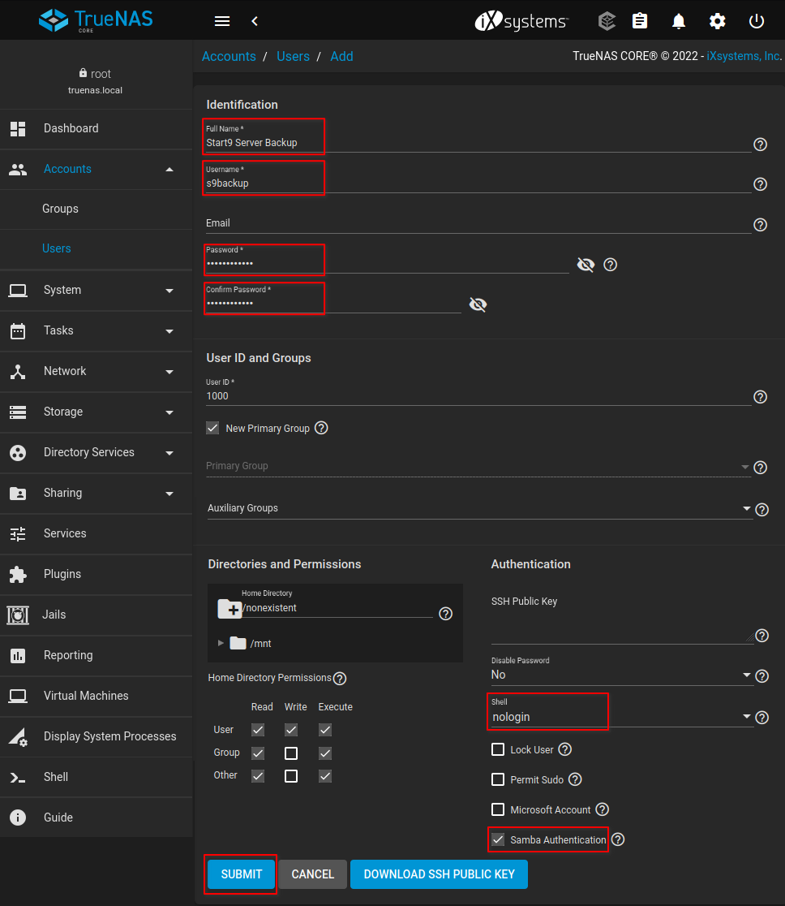
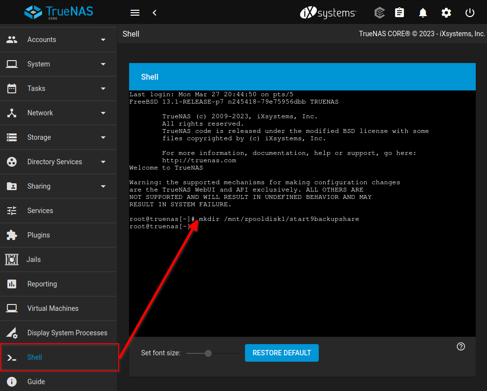
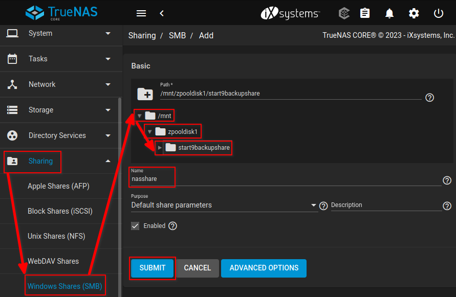
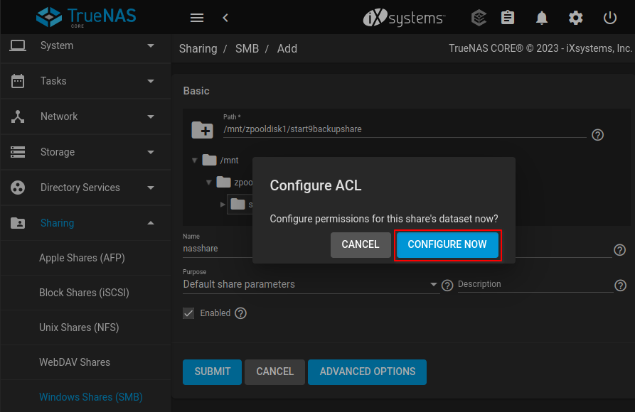
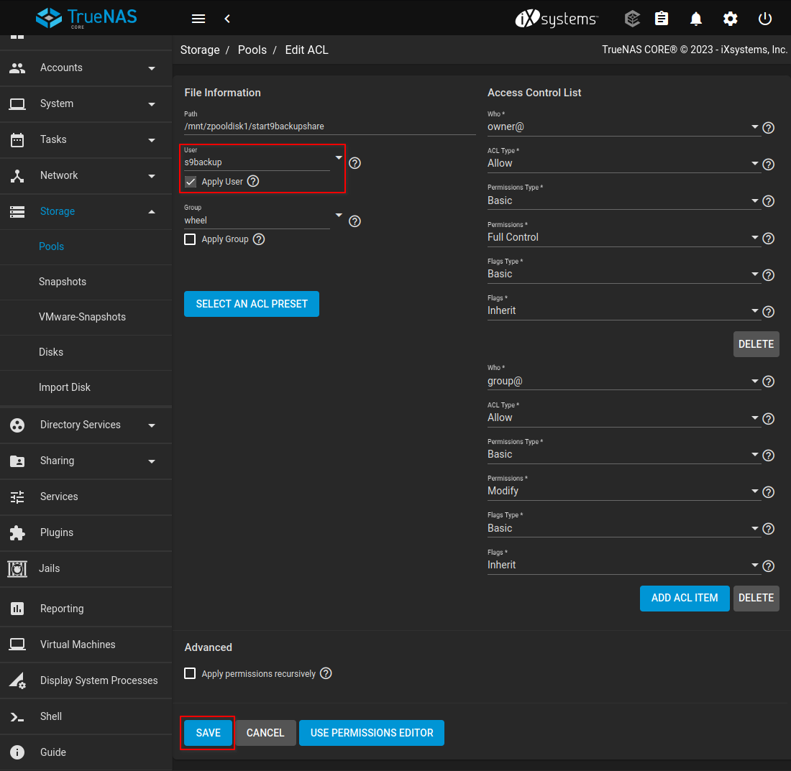

# Creating Backups to TrueNAS

## Create a Shared Folder

1.  Ensure you have already created a ZFS disk pool in `Storage > Pool` as a place to store your backups. If you need help with this step, see the [TrueNAS documentation](https://www.truenas.com/docs/scale/scaletutorials/storage/pools/createpoolscale/#creating-a-pool).

1.  In the TrueNAS UI, create a user for writing backups. Go to `Accounts > Users > ADD`.

    

1.  Enter a Full Name, Username, and Password for the new user. Near the bottom, click "Shell: nologin", and enable "Samba Authentication". Click "SUBMIT". In this example, we will use "Start9 Server Backup" for the full name and "s9backup" for the username. You may choose a different values.

    

1.  Go to `Services > SMB`. enable SMB and check the box "Start Automatically".

    

1.  Open a shell and create your backups directory. In this example, we will create a directory called `start9backupshare` in the root of our storage pool. You may choose a different name or path.

        mkdir /mnt/zpooldisk1/start9backupshare

    

1.  Under `Sharing > Windows Shares (SMB)`, drill down into the path until you find the directory to be shared. Give the share a name and click "SUBMIT". In this example we will name the share the `nasshare`. You may choose a different name.

    

1.  A `Configure ACL` dialog will emerge. Click "CONFIGURE NOW".

    

1.  You will be brought to an `Edit ACL` screen. Under "User", click "Apply User" and select the username we created in step 3. On the right-hand side, `Permissions Type` should be set to "Basic" and `Permissions` should be set to "Full Control". Click **SAVE**

    

## Create a Backup

1.  In StartOS, go to `System > Create Backup`.

1.  Click "Open New".

1.  Complete the form:

    1.  **Hostname**: The name of your TrueNAS device on the LAN. (e.g truenas.local)

    1.  **Path** - The _name_ of your shared folder, _not_ the full directory path (e.g. "nasshare" from the example).

    1.  **Username** - Your TrueNAS user who owns the shared folder. (e.g. "s9backup" from the example)

    1.  **Password** - Your password for the above user.

1.  Click "Connect".

    ```admonish warning title="Troubleshooting"

    - If you receive `Filesystem I/O Error mount error(13): Permission denied`, ensure you have entered all the correct values in the form. The hostname can be particularly tricky.
    ```
