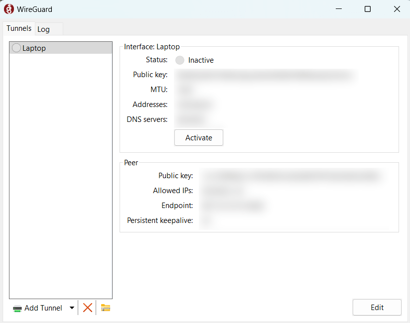
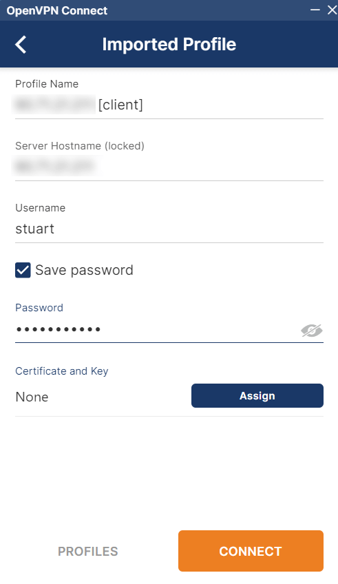

# Connecting via router VPN (Windows)

Follow this guide to connect your Windows device to your Router VPN in order to access your StartOS server and installed services.

#### Prerequisites

- [Connecting Remotely - Router VPN](../../user-manual/connecting-remotely/vpn.md)

#### Contents

- [WireGuard](#wireguard)
- [OpenVPN](#openvpn)

## WireGuard

1. In your router's WireGuard server, create a new profile/configuration for your Windows device. Download the configuration file.

   

1. Install WireGuard from the [official website](https://www.wireguard.com/install/).

1. Click "Import tunnel(s) from file" and select the file you downloaded above.

   

   

1. Your VPN tunnel will have been created and visible conveniently in the WireGuard app where you can click to activate it via the 'Activate' button.

   

## OpenVPN

1. OpenVPN Connect from the [official website](https://openvpn.net/client/client-connect-vpn-for-windows/).

   

1. Download the configuration file from your router's OpenVPN server.

   

1. Import the configuration file and enter the necessary authentication settings you chose or were default on your OpenVPN Server on your router

   

1. Depending on how you've configured your OpenVPN server, you may need to add a username and password before you hit Connect.

   

1. Once set up, click on the name of the profile allows you to connect and disconnect. You can edit the profile from the icon to its right.

   
