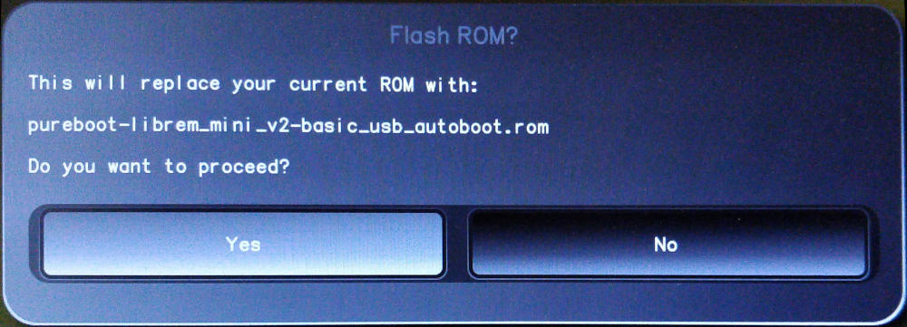
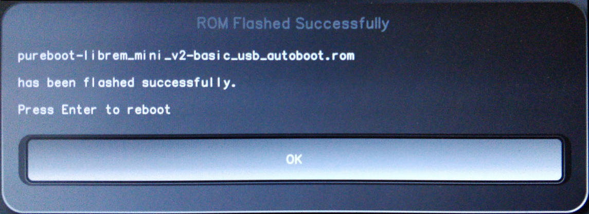

# Flashing Firmware - Server Pure

This page is for the Server Pure _only_. It will not work on other devices.

Generally, you do not need to manually flash your device using this guide, as the firmware is now automatically updated on supported devices. Please only use this method if directed by a Start9 Support Technician. **If you were told to "_flash your device_", you are looking for the StartOS flashing guides instead.**

## You Will Need

- A monitor and keyboard.
- A USB stick, formatted FAT32.

## Instructions

1. Power down your server if not already.

1. Connect a monitor and keyboard to your server using two of the USB3 (blue) ports.

1. Download the right firmware:

   - Models without WiFi - <a href="https://source.puri.sm/firmware/releases/-/blob/75631ad6dcf7e6ee73e06a517ac7dc4e017518b7/librem_mini_v2/custom/pureboot-librem_mini_v2-basic_usb_autoboot-Release-29.zip" target="_blank">Download Standard</a>
   - Models with WiFi - <a href="https://source.puri.sm/firmware/releases/-/blob/75631ad6dcf7e6ee73e06a517ac7dc4e017518b7/librem_mini_v2/custom/pureboot-librem_mini_v2-basic_usb_autoboot-Release-29.zip" target="_blank">Download Standard</a> | <a href="https://source.puri.sm/firmware/releases/-/blob/75631ad6dcf7e6ee73e06a517ac7dc4e017518b7/librem_mini_v2/custom/pureboot-librem_mini_v2-basic_usb_autoboot_blob_jail-Release-29.zip" target="_blank">Download Jailed WiFi</a>

   ```admonish note
   The Jailed WiFi variation deactivates WiFi at the firmware level so it can never be turned on
   ```

1. Copy or move the zip file to the USB stick.

1. Eject the USB stick and insert it into your server using a USB3 (blue) slot.

1. Turn on the server while pressing the `ESC` key on the keyboard repeatedly until you see the PureBoot Basic Boot Menu screen. Select "Options -->".

   

1. Select "Flash/Update the BIOS".

   

1. Select "Flash the firmware with a new ROM, erase settings".

   

1. The system will ask if you want to proceed flashing the BIOS with a new ROM, select "Yes".

   

1. Choose the file that we downloaded and copied to the USB stick.

   

1. Confirm you want to proceed with the flash by selecting "Yes".

   

1. The BIOS will be re-flashed with the new firmware. This may take a few minutes. When complete, remove the firmware USB, then select "OK" to complete the process.

   
