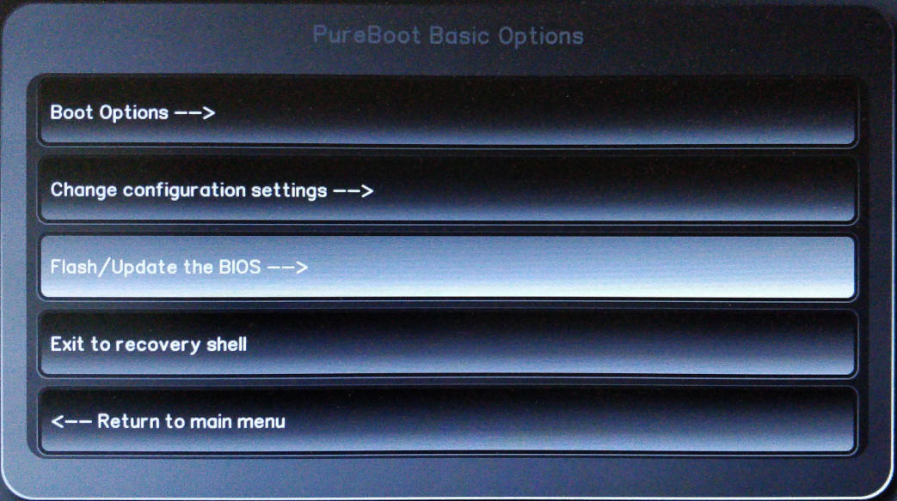

# Flashing Firmware - Server Pure

This page is for the Server Pure _only_. It will not work on other devices.

It is generally unnecessary to flash your device in this manner. Please only use this method if directed by a Start9 team member.

The firmware source code can be viewed <a href="https://source.puri.sm/firmware/releases/-/tree/master/librem_mini_v2/custom" target="_blank">here</a>.

## Prerequisites

- A monitor and keyboard.
- A USB stick, formatted FAT32.

## Instructions

1. Power down your server if not already.

1. Connect a monitor and keyboard to your server using two of the USB3 (blue) ports.

1. Download the latest <a href="https://source.puri.sm/firmware/releases/-/blob/master/librem_mini_v2/custom/pureboot-librem_mini_v2-basic_usb_autoboot-Release-29.zip" target="_blank">firmware</a>.

1. Copy or move the zip file to the USB stick.

1. Eject the USB stick and insert it into your server using a USB3 (blue) slot.

1. Turn on the server while pressing the `ESC` key on the keyboard repeatedly until you see the PureBoot Basic Boot Menu screen. Select "Options -->".

   

1. Select "Flash/Update the BIOS".

   

1. Select "Flash the firmware with a new ROM, erase settings".

   

1. The system will ask if you want to proceed flashing the BIOS with a new ROM, select "Yes".

   

1. Choose the file that we downloaded and copied to the USB stick.

   

1. Confirm you want to proceed with the flash by selecting "Yes".

   

1. The BIOS will be re-flashed with the new firmware. This may take a few minutes. When complete, remove the firmware USB, then select "OK" to complete the process.

   
