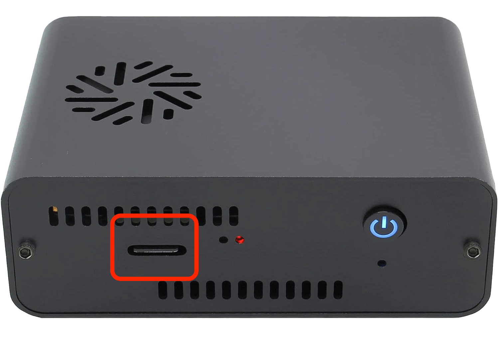
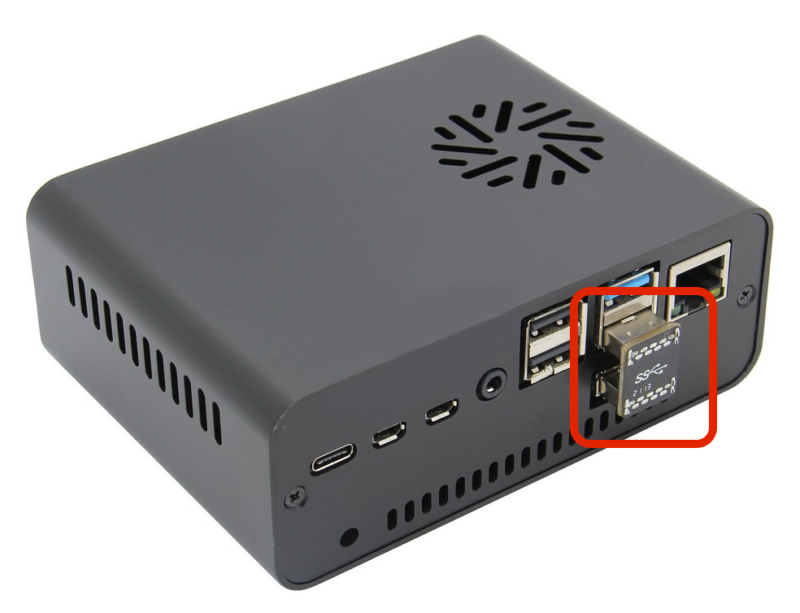
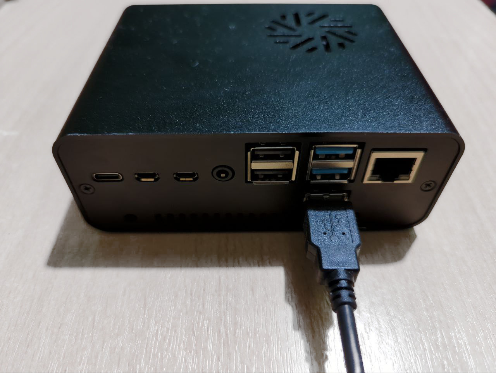

# Upgrading Your Raspberry Pi

Follow this guide to upgrade from a Raspberry Pi StartOS server to a Server One, Server Pure, or similar device.

#### Contents

- [From a Pi with External Drive](#from-a-pi-with-external-drive)
- [From 2022 Embassy One (NASPi case)](#from-embassy-one-naspi-case)

## From a Pi with External Drive

Use this section if your current StartOS Raspberry Pi uses an external drive over USB.

1. Stop every service on your Raspberry Pi server.

1. Shutdown your Raspberry Pi server and disconnect from power.

1. Connect your new server to power and ethernet.

1. Visit http://start.local on any computer on the same LAN.

1. Connect your previous storage drive to any USB-3 or USB-C port on your new server.

1. Select "Recover".

1. Select "Transfer".

1. On the "Transfer" screen, select the previous external storage drive.

1. On the "Select Storage Drive" screen, select your new storage drive. This is the internal drive of the new server.

1. Create a password for the new server. It can be the same as before.

1. Your data will now transfer. This can take minutes to hours, depending on how much data you have.

1. If you intend to re-purpose the Raspberry Pi as another StartOS server, _be sure to first re-flash the microSD, then perform a fresh setup_, which will wipe the SSD in the process. It is a good idea to wipe the SSD separately beforehand, just in case.

   ```admonish warning

   _Do not_ power on the Raspberry Pi until you have successfully re-flashed the microSD. If you power it on as-is, it can cause serious problems, including loss of funds if you are running a lightning node.
   ```

## From 2022 Embassy One (NASPi case)


1. Get a high quality [USB-A to USB-A cable](https://www.amazon.com/UGREEN-Transfer-Enclosures-Printers-Cameras/dp/B00P0E3954/?th=1).

1. Power down the old server, then pull out the micro SD card.

   

1. Disconnect the USB adapter.

   

1. Connect one side of the USB-A cable to the lowest blue USB port on the old server, then the other side to a blue USB port on your new server.

   

1. Power on the old server

1. The two servers are now tethered together, and the NASPi is now powered on.

1. Connect your new server to power and ethernet if not already and also power on.

1. Visit `http://start.local` on any computer on the same LAN.

1. Select "Recover".

1. Select "Transfer".

1. On the "Transfer" screen, Select the NASPi storage drive.

1. On the "Select Storage Drive" screen, select your new storage drive. This is the internal drive of the new server.

1. Create a password for the new server. It can be the same as before.

1. Your data will now transfer. This can take minutes to hours, depending on how much data you have.

1. If you intend to re-purpose the NASPi as another StartOS server, _be sure to first [reflash](../flashing-guides/startos/) the microSD, then perform a fresh setup_, which will wipe the SSD in the process.

   ```admonish warning

   _Do not_ re-insert and power on the Raspberry Pi until you have successfully [re-flashed](../flashing-guides/startos/) the microSD. If you power it on with an unflashed microSD inserted, it can cause serious problems, including loss of funds if you are running a lightning node.
   ```
