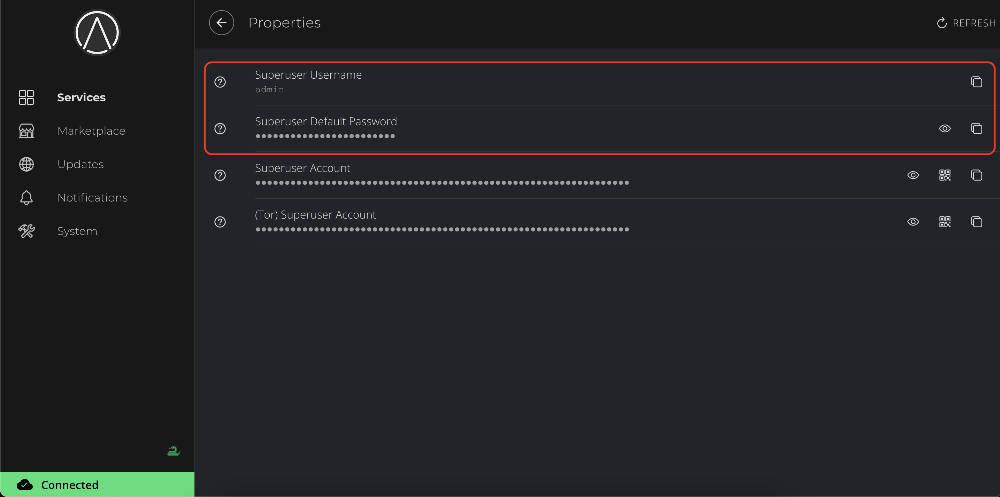
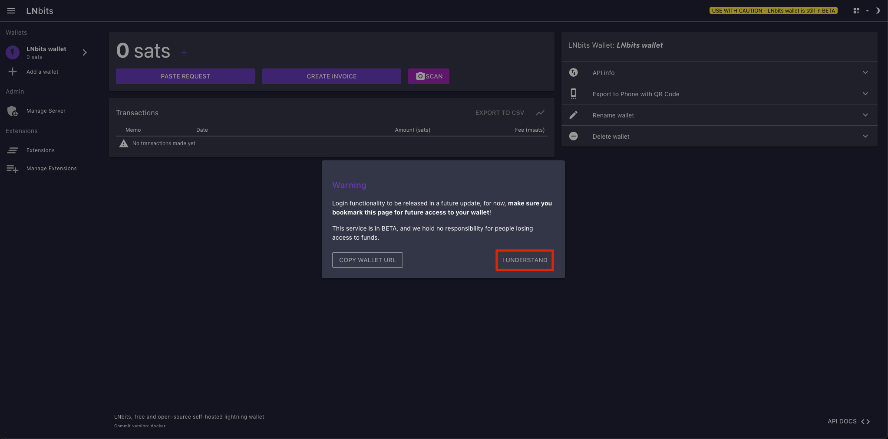
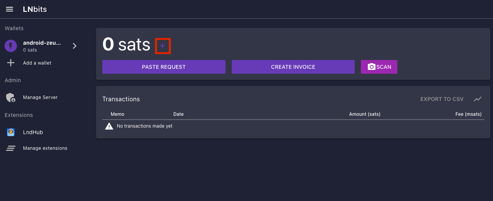
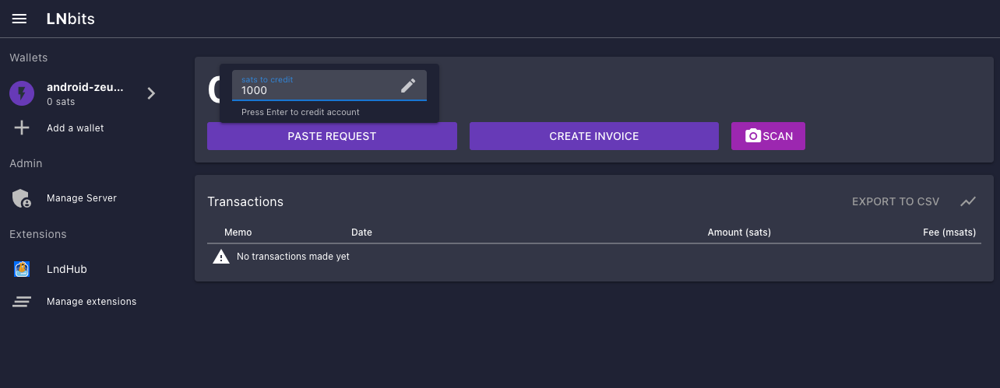
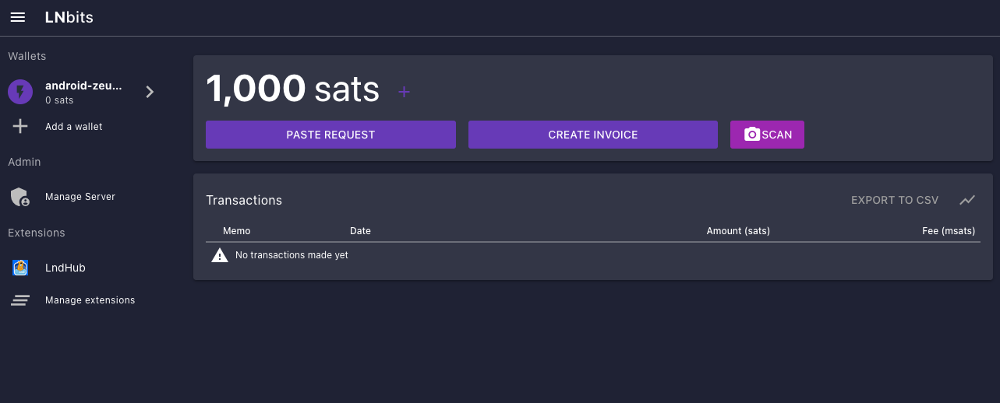

# Using LNbits

## The Concept

LNbits allows you to create a wallet that makes use of your node with only an alloted amount of sats. This restriction can be very helpful for if you only want to have a small amount for spending on your phone without making your entire lightning balance available. You can even allow other people to have wallets you create for them - think giving your children an allowance. They can start with a set amount (can be zero) and simply spend what you initially make available. They can also earn more for themselves as they will have the freedom to issue their own invoices - all while making use of your node.

```admonish tip

All wallets created this way are ultimately bound by the capacity of your node. If one wallet is allocated 10,000 sats but your underlying node only has 9000 sats of outbound capacity, payments will simply fail.

```

## What lightning node should I use?

LNbits will work for both **Core Lightning (CLN)** and **LND** *but* if you want to connect [Zeus](./lnbits/zeus.md) or [BlueWallet](./lnbits/bluewallet.md) to LNbits then **this will only work with LND** as the underlying node. This is because the LNDhub plugin will be required. 

If you are looking to connect the [Alby](https://github.com/getAlby/lightning-browser-extension#installation) browser extension to your LNbits wallet, that will work with **both CLN** *and* **LND**.


## Setting up LNbits

1. Start by ensuring that you have LNbits installed already as well as LND or Core Lightning (CLN). You also need your lightning node to have at least one channel set up otherwise payments will not work. If you have not set up a channel yet, please follow [this guide](opening-channels.md).


```admonish tip

 Remember - if you intend to connect BlueWallet or Zeus, that will only be possible with LND. Alby can work with both.

```

1. Navigate to Services -> LNbits, click `Launch UI`, and authenticate with your 'Superuser Username' and 'Superuser Default Password' found in LNbits -> Properties:

   

1. After logging into your LNbits account you'll see the following screen - click **I understand**:

   

    ```admonish note

    This isn't a concern on StartOS as all wallets created will have the address they generated stored within **Properties** within the LNbits serivce.

    ```

1. Now a default wallet will have already been generated - highlighted on the top left. We'll rename it to something we can remember by clicking **Rename wallet** entering **somthing-you-can-remember** then clicking **UPDATE NAME**:

   

Now you can proceed to connect one of the following wallets to LNbits using the guides below:

- [Alby](./lnbits/alby.md)
- [BlueWallet](./lnbits/bluewallet.md)
- [Zeus](./lnbits/zeus.md)

## Funding LNbits
--------------

After any of the above wallets has been setup with the corresponding instructions, you can allocate sats to this wallet within LNbits by clicking the **"+"** icon here:







```admonish warning

Remember: All wallets are ultimately bound by the capacity of your node. If one wallet is allocated 1,000 sats but your underlying node only has 900 sats of outbound capacity, payments will simply fail.

```

Your newly created LNbits wallet has now been funded and is ready to send sats over the Lightning Network!