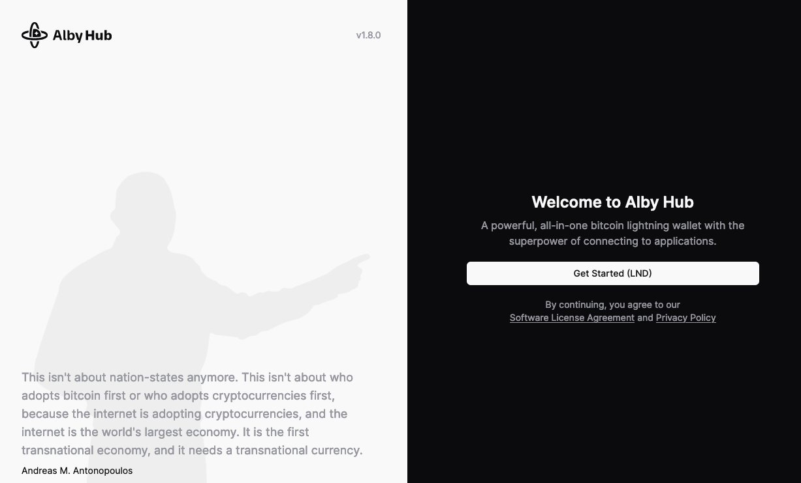
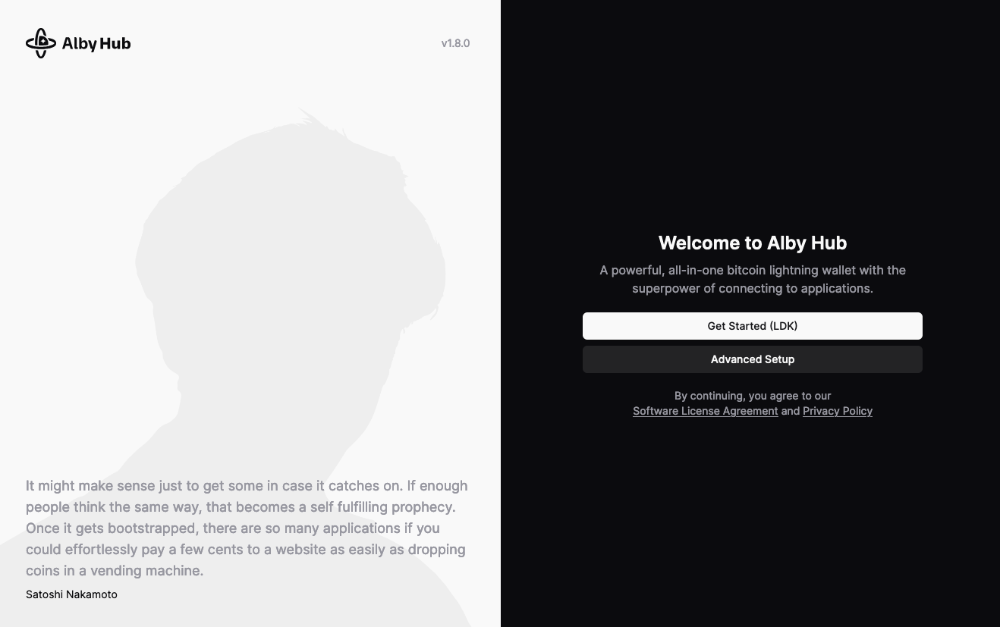
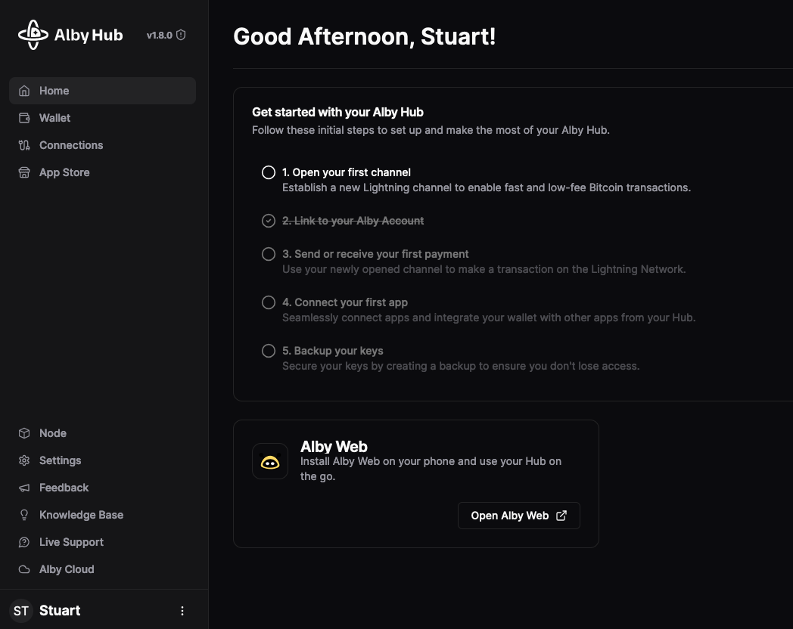
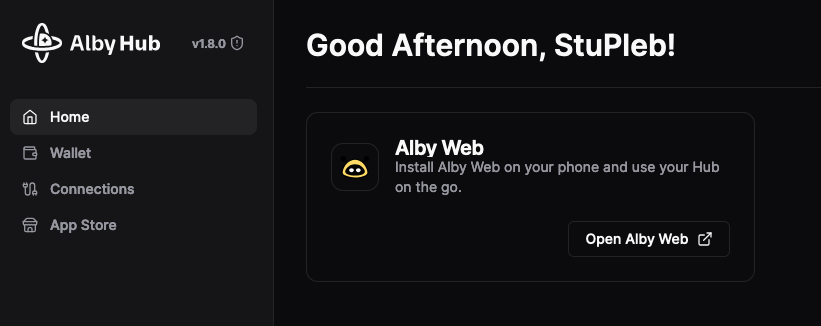
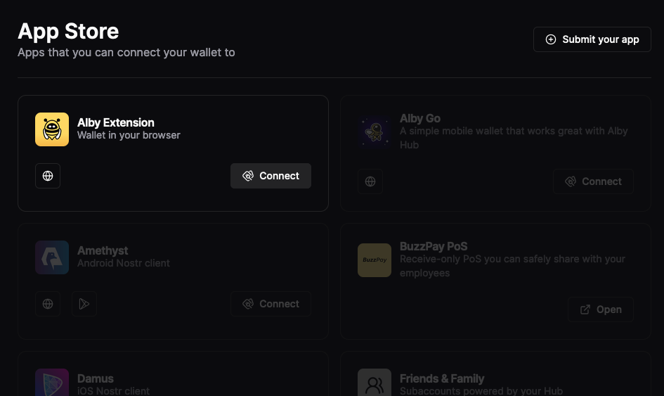
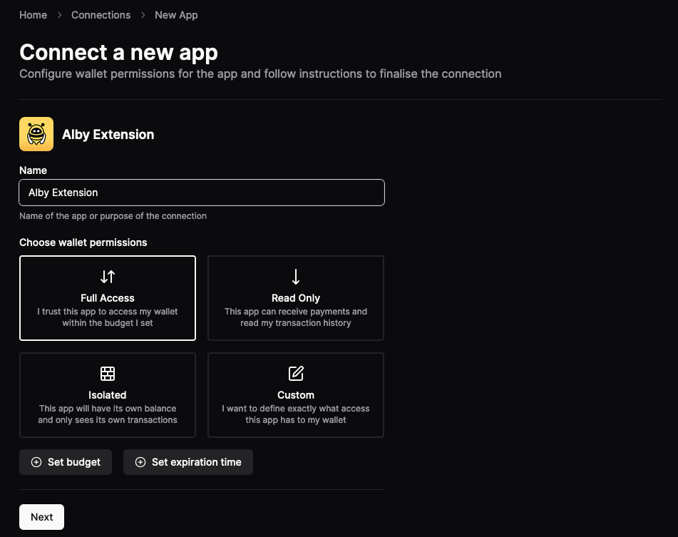
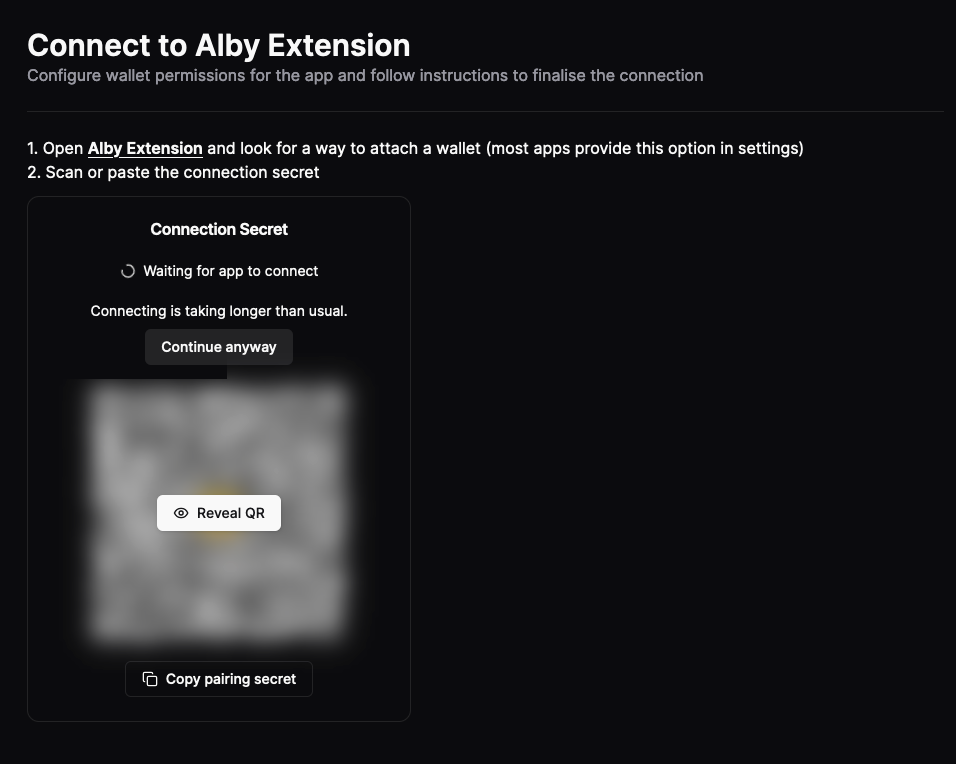
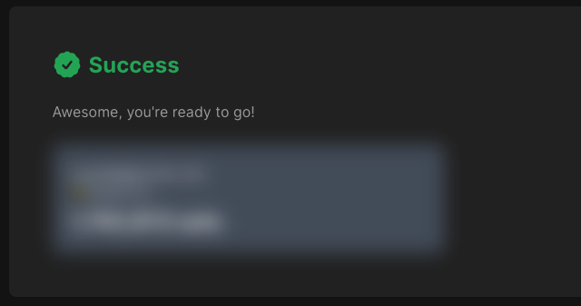

# Alby Hub

Alby Hub is the open-source, self-custodial Lightning wallet that puts you in control. Connect to your LND or to an integrated node, it's more than just a wallet—it's your gateway to Bitcoin. Manage channels, run apps, and take charge of your funds, all through one sleek, user-friendly interface. Empower your Bitcoin journey with simplicity and sovereignty. 

## Usage options


- **LND already on your server**: This option tells Alby Hub to use the LND node installed on this StartOS server. It is the more sovereign and secure option, allowing full control over your node.
    
- **Alby Hub embedded light node**: This option tells Alby Hub to use its own, built-in LDK *light node*. This option is convenient but offers less control over your node.


## Getting Started


1. Once you've made your decision on how to use Alby Hub, install it from the marketplace.

    


1. Click **Configure** 

    


1. And select your prefered usage type…

    


1. Hit **Save** and then start the service.


## LND on your server


You will be running Alby Hub on your server, and it will be connecting to LND on your server.

1. `Launch` the Alby Hub UI for the first time.

1. Cycle through the introduction to arrive at the setup screen.

    


1. Click on the **Get Started (LND)** button.

    


1. Enter a password and keep it somewhere safe, like in your personal :ref:`Vaultwarden<vaultwarden-service>` instance.

    


1. Select whether you will create an Alby account now or later (i.e. not at all).

    ```admonish note

    An Alby Account gives your hub a lightning address, Nostr address and zaps, email notifications, fiat topups, priority support, automatic channel backups, access to podcasting apps & more. If you choose not to create an account, your setup will be complete.

    ```

    


1. Connect your Alby account by clicking to request an authorization code. This will open a new tab.

    


1. If you have a pre-existing Alby account your can log in here, otherwise you can sign up.

    

    

 

1. You will get an authorization code to add back into the previous tab hosted on your server. Paste that auth code and hit **Submit**.

    


1. Your self-hosted Alby Hub is ready and connected to your self-hosted LND!


## Alby Hub embedded light node

You will be running Alb Hub on your server, and it will be connecting to LDK light node on your server. (The Alby Hub service will have a self-contained node, rather than connecting to an external instance of the LND servic. Keep this in mind when considering backups!)

1. `Launch` the Alby Hub UI for the first time.

1. Cycle through the introduction to arrive at the setup screen.

    


1. Click on the **Get Started (LDK)** button.

    


1. Enter a password and keep it somewhere safe, like in your personal Vaultwarden.

    


1. Select whether you will create an Alby account now or later (i.e. not at all).

    ```admonish note
    
    An Alby Account gives your hub a lightning address, Nostr address and zaps, email notifications, fiat topups, priority support, automatic channel backups, access to podcasting apps & more. If you choose not to create an account, your setup will be complete.

    ```

    


1. Connect your Alby account by clicking to request an authorization code. This will open a new tab.

    


1. If you have a pre-existing Alby account your can log in here, otherwise you can sign up.

    

    


1. You will get an authorization code to add back into the previous tab hosted on your server. Paste that auth code and hit **Submit**.

    

1. Your self-hosted Alby Hub is ready and connected to your self-hosted LDK light node!


## Connecting Apps

Two of the more important apps you may want to install are:

- **Alby Web** (a simple wallet interface that connects to your Alby Hub and can be saved as a PWA (app-like) on your phone)
- **Alby Extension** (companion for accessing Bitcoin and Nostr apps, payments across the globe and passwordless logins)

### Alby Web


1. If you have connected your Alby Hub to an Alby account during setup, Alby Web will appear connected by default. (If you have not, you can go to **Settings** > **Alby Account** to add an account).

    

    


This wallet interface allows you to interact with your Alby Hub-connected LND over clearnet with a easy to use interface.


### Alby Extension


1. Visit the App Store from your Alby Hub.

    


1. Click **Connect**.

    


1. Give the connection to your Alby Extenions a name and decide what access and limitations you give it.

    ```admonish note
    
    The settings are fairly self explanatory. Typically you'll want your browser extension to be able to have full access to your lightning node and funds since you will be the only one using it and will want to both make and receive payments. Payments you make have to be confirmed and authorized through the extension, but if you are worried about overspending, the advanced **Budget** option sets monthly limits on how much can be spent. This is useful in case you get carried away zapping or if you ever misread a payment request that's higher than you expect.

    ```

    


1. Download the extension for your browser if you don't have it already. Install it. Open it if you do already have it installed.

1. If the extenstion is installed on the same browser, click the newly appeared icon in the menu bar while on the screen above. Click to connect.

    


1. You can now spend sats and generate invoices from your browser! Test it out by running your own [noStrudel](/service-guides/nostr/nostrudel.md) instance.

## Resources and Guides


**Alby** have extensive users guides [available here](https://guides.getalby.com/user-guide/v/alby-account-and-browser-extension/alby-hub/introduction). Learn how to connect other apps and use the advanced features available to those who set up Alby accounts.

**BTC Sessions** has created an Alby Hub [tutorial here](https://www.youtube.com/watch?v=2Z1BzwxdP4I). While this focuses on the cloud hosted variety of Alby Hub, the interface and features are the same, and the Start9 hosted variety gets a mention in the last segment.