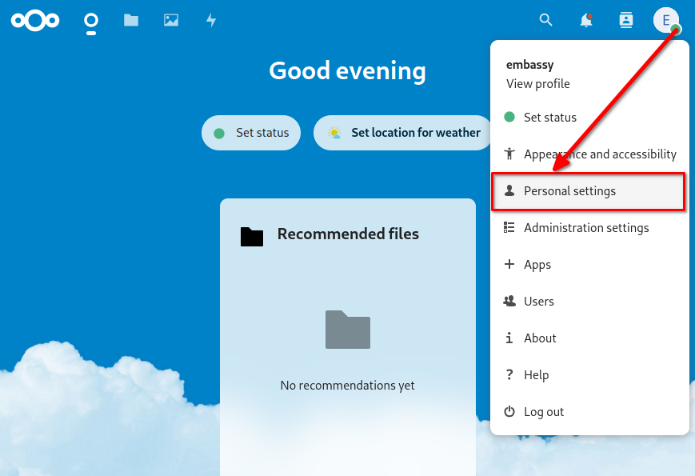
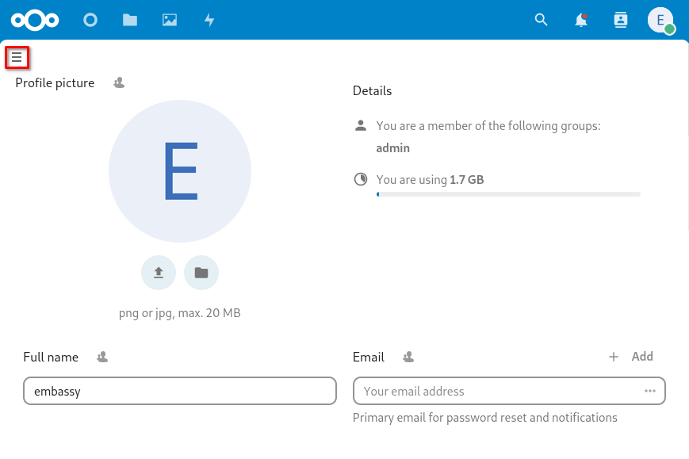
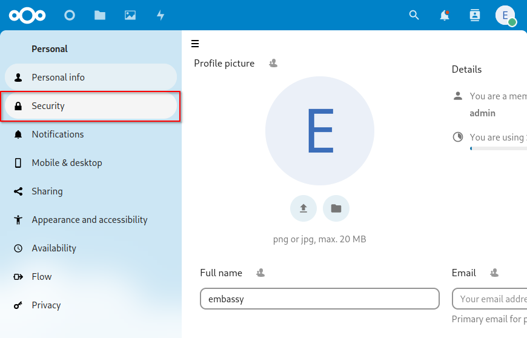
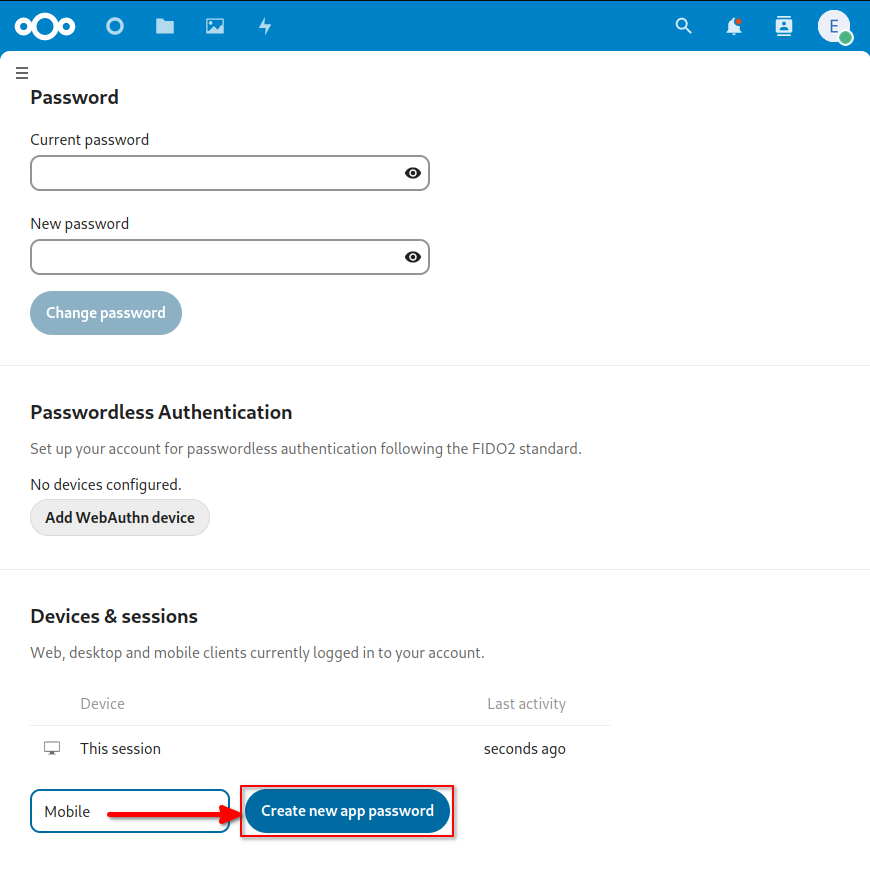
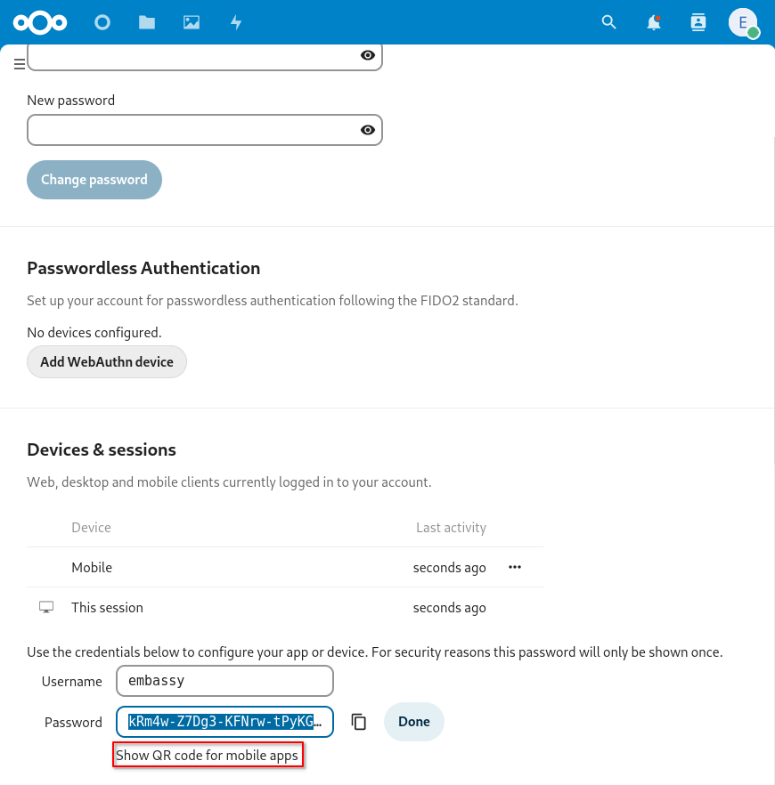
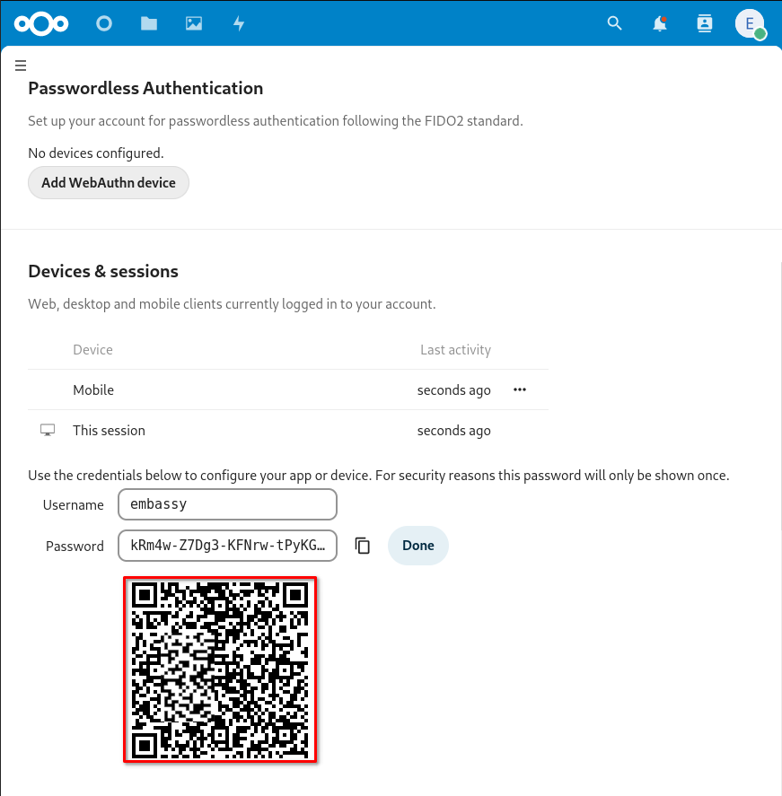
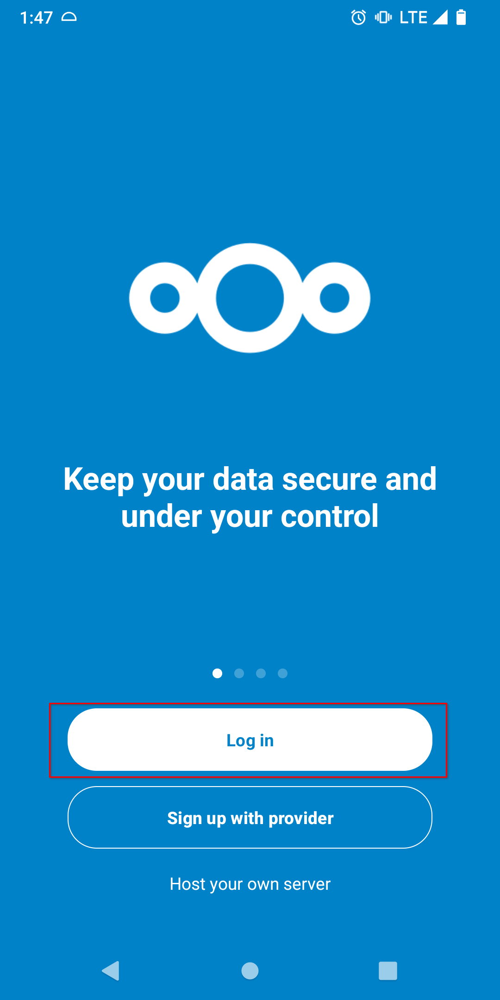
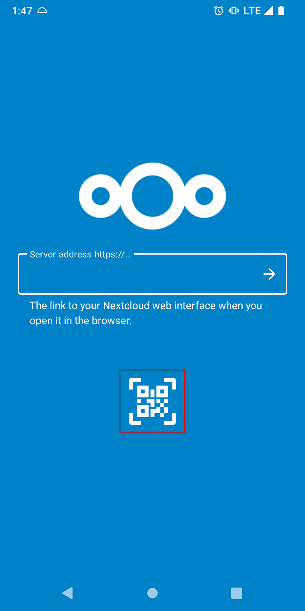

# Nextcloud - Android

## Initial Config

For the best experience, it is recommended to set up your Nextcloud devices on [LAN](/user-manual/connecting-locally.md) with a designated IP address and port. This setup allows you to sync files, calendars, and contacts while away from home using a [Router VPN](/user-manual/connecting-remotely.md).

Once configured, you can also use Tor for remote syncing. However, keep in mind that transferring large files may fail or take a considerable amount of time. Therefore, it is advisable to use remote syncing primarily for low-bandwidth activities, such as syncing calendars, contacts, tasks, and notes. Streaming music is also possible.

```admonish warning

When using remote connections, be mindful of any data caps on your cellular plan. You may need to limit bandwidth usage by disconnecting from your Router VPN server or Tor when using cellular data.

```

## Nextcloud App

The latest version of the official Nextcloud client is available on their [download page](https://nextcloud.com/install/#install-clients).  This is for file syncing and account management.


## LAN/Router VPN Setup

Make sure you have first set up [LAN access](/device-guides/android/ca.md).

1. Open Nextcloud via your server's Services -> Nextcloud -> Launch UI

1. Log in and select the top right icon -> Personal Settings:

     


1. Select the hamburger (3 lines) menu:

    


1. Select Security:

    


1. Under `Devices & sessions`, give this Nextcloud mobile app a session name, such as "Mobile" and tap `Create new app password`:

    
    

1.  Tap `Show QR code for mobile apps`:
  
    


1. The new session's QR code will be displayed:

    

1. Download and install the appropriate desktop client for your Android device from https://nextcloud.com/install/#install-clients

1. Open the Nextcloud client on your Android device and tap "Log in"

    


1. Tap the QR code icon:

    


1. Scan the QR code presented in Step 7.


```admonish note

Here you may see an error about the Nextcloud app being unable to find the host that was decoded from the QR code:


If you see this message, you may be on an Android version that does not support mDNS .local name resolution (it is available on Android 13+ and some builds of Android 12, but not all.  The other possibility is that your WiFi network is not properly "bridged" with the ethernet network that your Start9 server is on, or you lack WiFi connectivity to your network in general.

```
        


```admonish note

Alternatively, you may see a warning about an untrusted certificate:


In this case, make sure you have [added your server's CA certificate to the Android trust store](/device-guides/android/ca.md) as noted at the top of the `LAN Setup` section of this guide, close the Nextcloud mobile app and try again.  Otherwise, proceed to the next step.

```

1. Android may ask you about Storage permissions.  Grant "Full access":

    

1. Next, configure the local directory that you want to sync with Nextcloud. You may use the default or change it, and edit the sync settings to desired. When satisfied, tap "Connect"

1. Files will begin to sync immediately and you will see a green check when this is complete.

1. That's it! From this desktop client you will recieve notifications, control accounts and syncing, and quickly access your Apps' WebUI pages


## Tor Setup

You will first need to have [Orbot running](/src/device-guides/android/tor.md).

1. First, add Nextcloud to your Orbot apps list.
2. Tap the account in the top-right, then "Add Account."
3. On the following screen, tap "Log in," then enter your Nextcloud Tor server address, which you can copy from Nextcloud -> Interfaces - Tor. This should start with ``https://`` and end with ``.onion``. tap Next.
4. This will launch your browser and prompt you to log in to your account. Log in and then grant access as we did for LAN.
5. That's it! You may wish to set up some select folders for remote sync, but for large files, it is best to sync on LAN only, so you can "Skip folders configuration" on the resulting screen if you wish. Check your connection by tapping into the newly created account in the app.


### Device Integration

In order to sync calendars and contacts with your Android device, follow the steps below, which are adapted from the [Official Nextcloud guide](https://docs.nextcloud.com/server/25/user_manual/en/groupware/sync_android.html).  First head into the top-righthand menu of your Nextcloud's WebUI and click "Apps," then search for and install the Calendar and/or Contacts Apps.

1. Download the WebDAV sync management client [DAVx5](https://www.davx5.com/download/) from your app store of choice, such as F-Droid or the Play Store.

2. Add account:

   - If you are on Android 12+ and already have the Nextcloud file-syncing app (recommended - guide above), then open it and enter the "Settings" menu from the top-lefthand hamburger (3 lines) menu.  Then under the section titled, "More," tap "Sync Calendar & Contacts."

     - This will open Nextcloud's WebFlow login in a browser, where you will need to log in and "Grant Access" - you will then be returned to DAVx5
     
     - Set an account name when asked, then set "Contact Group Method" to "Groups are per-contact categories" - DAVx5 will close and Nextcloud will reappear.
     
     - Manually launch DAVx5 again and top on the account that was just created.  Grant access to Calendars and Contacts when requested, and optionally tasks, if you added that feature in setup.  Choose the address books and calendars you wish to sync and you're done!

   - If you are NOT using the Nextcloud app already, then open DAVx5 and after going through the introduction (optionally selecting additional features), tap the "+" icon to add a new account, then select "Login with URL and user name," and fill in the following fields:

     - Base URL - Enter your Nextcloud WebDAV Base LAN URL (found in "Properties" in the Nextcloud service page).

     - User name - Your Nextcloud user (defaults are found in "Properties" on your Nextcloud service page)

     - Password - Your Nextcloud user's password (defaults are found in "Properties" on your Nextcloud service page)

     - If given the option, select "Groups are per-contact categories," then tap "Login."  Select the data you want to sync, grant access for contacts, calendars, and optionally tasks if you added that feature in setup.  That's it, you're done!
     
    ```admonish tip
    
    You may also wish to add the [ICSx5](https://icsx5.bitfire.at/) app, which allows subscription to remote WebCal or local iCal files (such as public event schedules, iCloud/Google calendars, etc).  It can be found in your favorite app store.

    ```