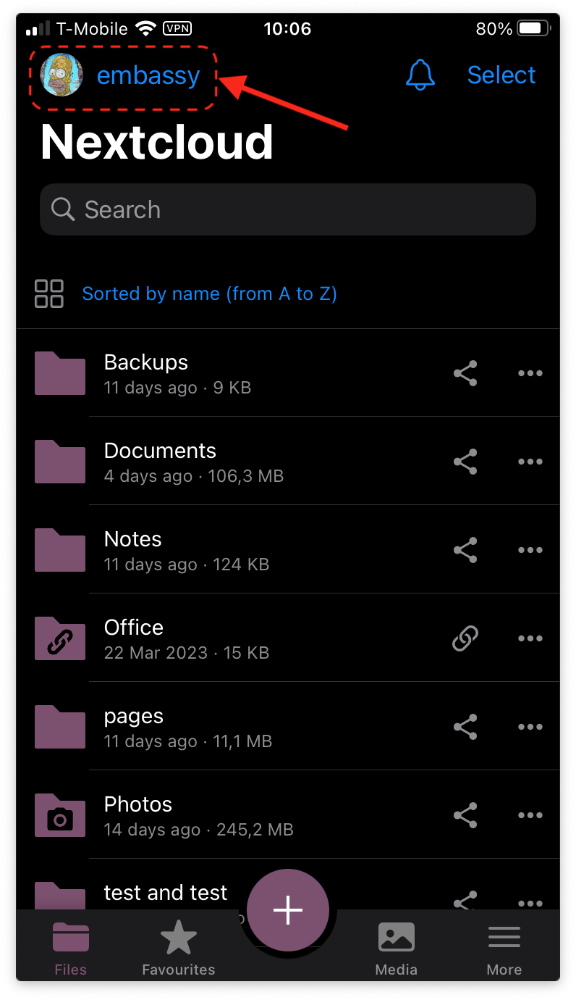
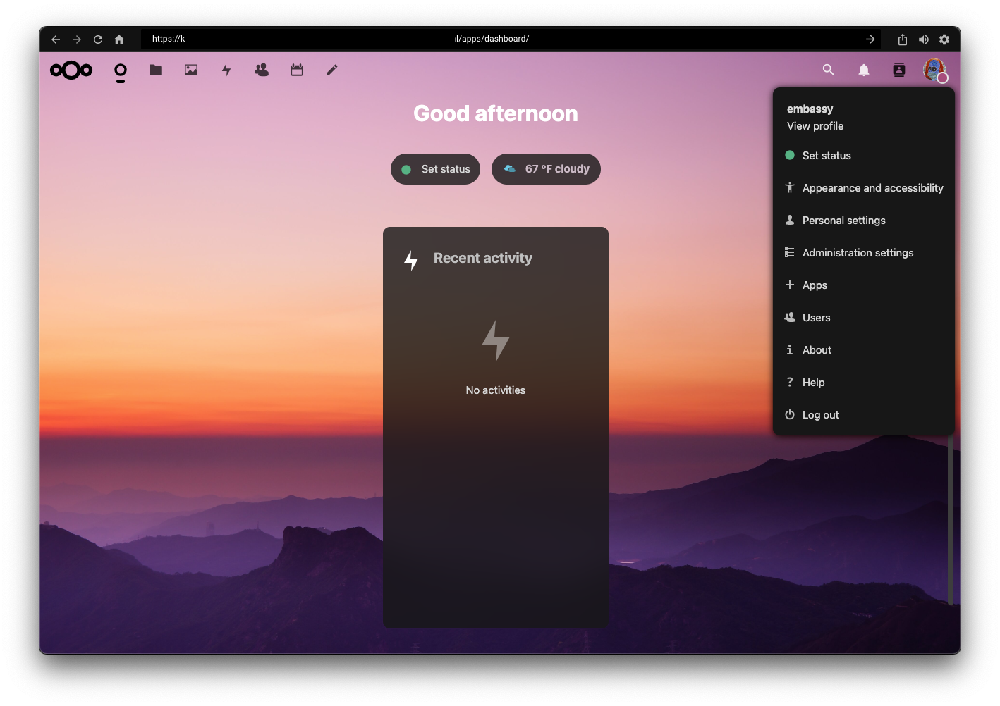
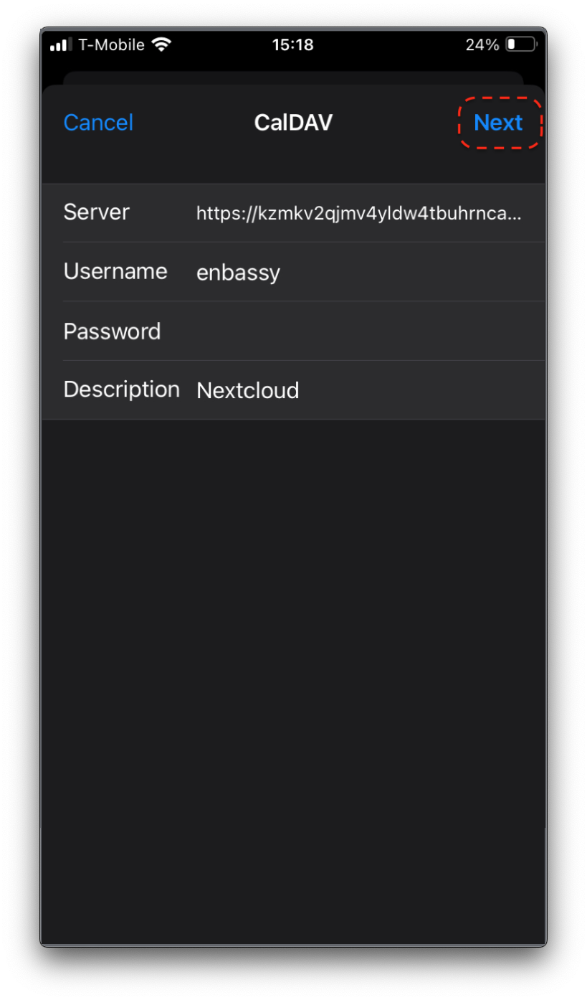

# Nextcloud - iOS 


## Initial Config

It is advised to setup your Nextcloud devices on LAN (if available) for the best experience.  Once set up, Tor can be used for remote syncing, but remember that large files will likely fail or take a very long time, so it is best to use remote sync only for low-bandwidth activity, such as Calendar, Contacts, Tasks, and Notes.  Streaming your music is also possible.  Later in 2023, new connection options will unlock Nextcloud's full feature-set.


## Standalone Client

The latest version of the official Nextcloud client is available on their [download page](https://nextcloud.com/install/#install-clients).


## LAN Setup

Make sure you have first set up [LAN access](/device-guides/ios/ca.md).

1. Download the iOS Nextcloud client from [App Store](https://apps.apple.com/app/nextcloud/id1125420102).
1. Open the client and tap "Log In".

    

   
1. From your server's Nextcloud Service page, go to "Interfaces" and copy the LAN address.
   
    


1. Enter your LAN address under "Server Address" and tap "Next".
   
    


1. You will be shown the "Connect to your account" screen, and then click "Log In" and "Grant Access".
    
    

    


1. Next, you will be asked to enter the username and password, which can be found on the startOS Nextcloud Service page under the "Properties" tab.
    


1. The account access page will be displayed, tap "Grant access".

    


1. Files will begin syncing immediately, and you will see your username and account icon in the top left corner.

    

    
1.  That's it! From this mobile client you can receive notifications, control accounts and syncing, and quickly access your apps' WebUI pages.


## Tor Setup

You will first need to have the [Tor daemon running](/device-guides/ios/tor.md).

1. Click the account in the top left again, then "Add Account."
2. On the following screen, click "Log in," then enter your Nextcloud Tor server address, which you can copy from Nextcloud -> Interfaces - Tor. This should start with ``https://`` and end with ``.onion``. Click Next.
3. This will launch your browser and prompt you to log in to your account. Log in and then grant access as we did for LAN.
4. That's it! You may wish to set up some select folders for remote sync, but for large files, it is best to sync on LAN only, so you can "Skip folders configuration" on the resulting screen if you wish. Check your connection by clicking the newly created account in the client app.

## Device Integration

In order to sync calendars and contacts with your iOS device, follow the steps below, which are adapted from the [Official Nextcloud guide](https://docs.nextcloud.com/server/25/user_manual/en/groupware/sync_ios.html).  

First head into the top-righthand menu of your Nextcloud's WebUI and click "Apps," then search for and install the Calendar and/or Contacts Apps. Next folow guide for iOS.




1. Open the "Settings" app on iOS device.

    ```admonish note

    You will need to perform 2 individual setups, one for Calendar and one for Contacts.

    ```

1. Select "Calendar" (or "Contacts") -> "Accounts" -> "Add Account" -> "Other" -> "either CalDAV (for Calendar setup) or CardDAV (for Contacts setup)".  Return to this step after completing one in order to add the other.


1. Enter the following fields and tap "Next":

  - Server - Copy your URL from Nextcloud -> Calendar settings -> Copy iOS/macOS CalDav address. For setting up contacts/CardDav use the same path.
  
  - User name - The default user is "embassy" but this is your user within Nextcloud, so be sure it is the correct user if you have more than one.
  
  - Password - In your Nextcloud WebUI, visit the top-right-hand menu and select “Personal Settings” -> “Security.” At the bottom, under Devices & Sessions, create a new app password with a name of your choice, such as “iOSCalDAV.” Then, copy the resulting password into your iOS CalDAV account configuration.

  - Description - Anything to describe this account, such as "Nextcloud CalDAV".




1. If you get a warning about verifying the server identity, it is safe to "Continue."  Add the apps you want to use, such as Calendars, Contacts, and/or Reminders, then tap "Next".

  - That's it!  Go back to step 2 above to set up your other account (CalDAV / CardDAV).

