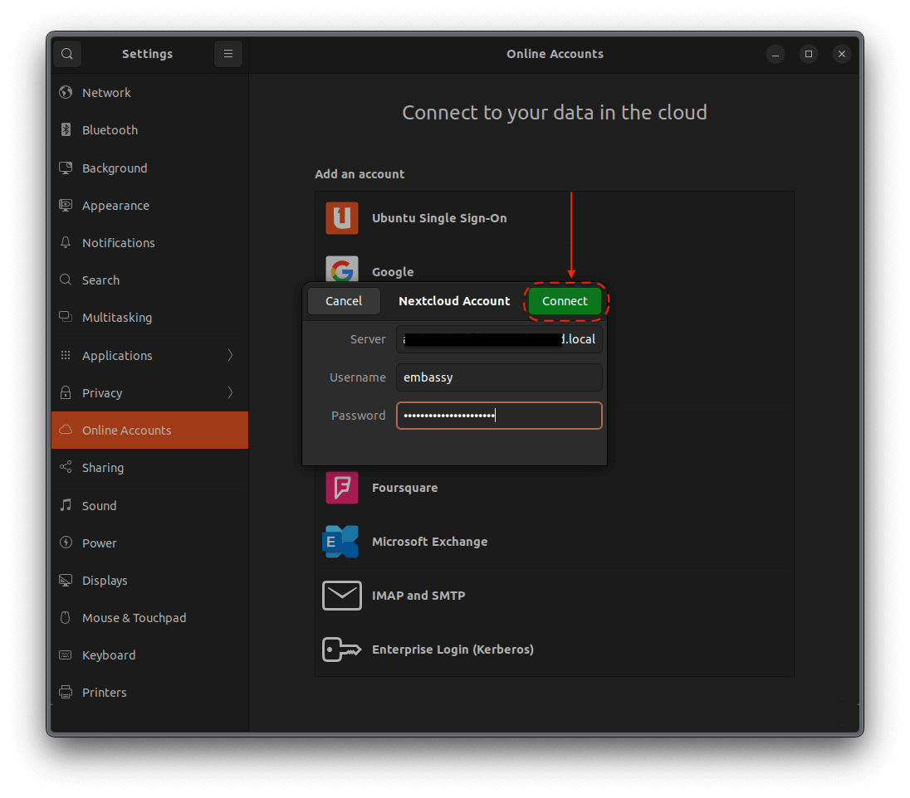
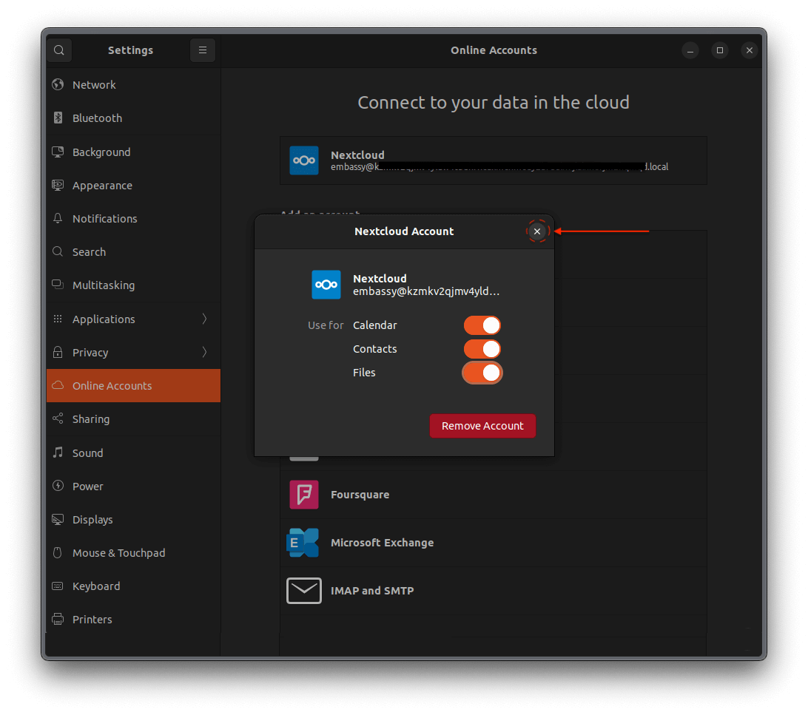
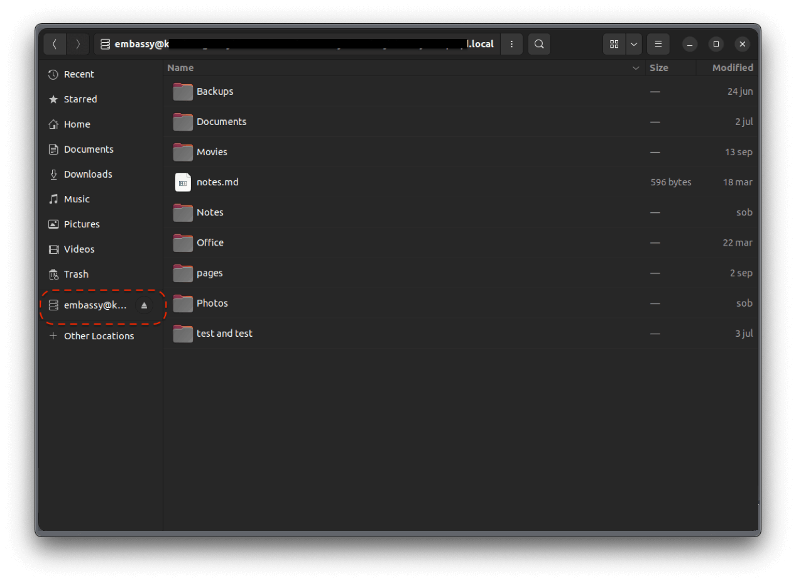
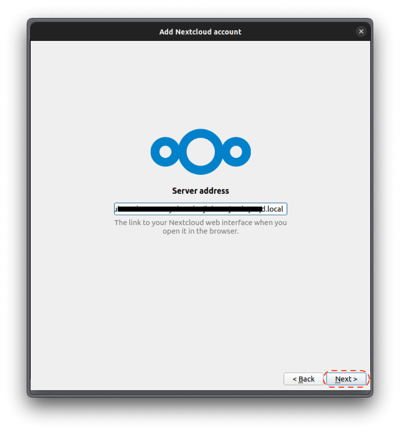
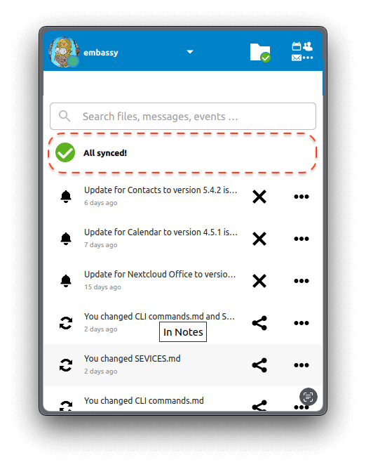
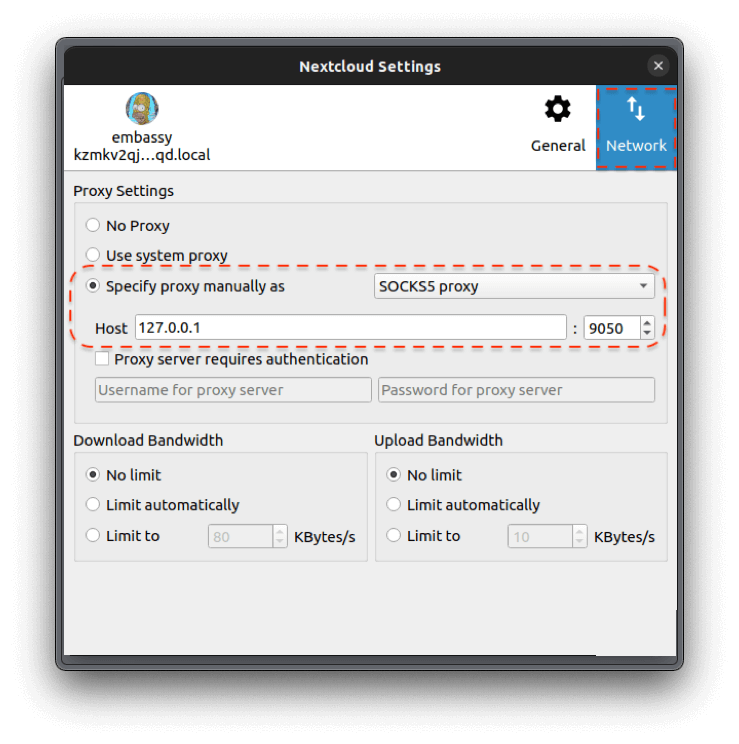
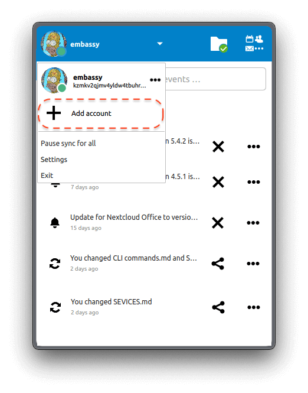

# Nextcloud - Linux

## Initial Config

For the best experience, it is recommended to set up your Nextcloud devices on [LAN](/user-manual/connecting-locally.md) with a designated IP address and port. This setup allows you to sync files, calendars, and contacts while away from home using a [Router VPN](/user-manual/connecting-remotely/vpn.md).

Once configured, you can also use Tor for remote syncing. However, keep in mind that transferring large files may fail or take a considerable amount of time. Therefore, it is advisable to use remote syncing primarily for low-bandwidth activities, such as syncing calendars, contacts, tasks, and notes. Streaming music is also possible.

```admonish warning

When using remote connections, be mindful of any data caps on your cellular plan. You may need to limit bandwidth usage by disconnecting from your Router VPN server or Tor when using cellular data.

```

## Desktop Integrations

Many Linux distributions ship with a Desktop Environment (DE) that supports Nextcloud account integration directly for use with their built-in calendars and other applications. It is recommended to try these first for the best possible experience with your particular flavor of Linux.

You will first need to [trust your Root CA](device-guides/linux/ca.md).

The following desktop environments support integrated account syncing, including Nextcloud:

- Gnome (Ubuntu default)
- Cinnamon (Linux Mint default)
- KDE
- Budgie

The following guide uses Ubuntu as an example.

1. Open settings app.

   

1. Go to Online Accounts and click on **Nextcloud**.

   

1. Paste in the server path from **StartOS > Nextcloud > Interfaces** and the username and password from **StartOS > Nextcloud > Properties**, and click **Connect**.

   

1. Choose which services you want to integrate and close **Nextcloud Account** window.

   

1. Open the file manager, and you should see your NextCloud account in the side panel.

   

To setup other Linux distributions, check out this [Linuxhint guide](https://linuxhint.com/linux_file_managers_nextcloud/) and our [Nextcloud Master Thread](https://community.start9.com/t/nextcloud-master-thread/). Please share your feedback - it is very valuable to our community!

## Standalone Clients

For those that prefer to use a desktop client or your desktop environment does not support account integrations.

```admonish note

The desktop version of NextCloud doesn't have much of a user interface.  Once installed, it solely lives in the your system tray or navigation bar.  You can click on this icon to access the app.

```

## File Syncing - Nextcloud Desktop

This is Nextcloud's official client application for file syncing and account management. It is available in your favorite package manager (usually as `nextcloud`). You can also see this [full list of available packages](https://help.nextcloud.com/t/linux-packages-status/). or you can get the latest version as an AppImage from the [Download for Desktop](https://nextcloud.com/install/#install-clients) section of Nextcloud's website.

## LAN/Router VPN Setup

Make sure you have first set up your [trusted Root CA](/device-guides/linux/ca.md).

1. Open the client and click **Log In to your Nextcloud**.

   

1. From your server's Nextcloud service page, go to **Interfaces** and copy the IP address and port, or .local and port.

   

1. Enter your IP address and port, or .local and port under **Server Address** and click **Next**.

   

1. This will launch a page in your web browser, click **Log In** and then **Grant access** to link the desktop client. You can close this browser window afterwards.

   

1. Next, configure the local directory that you want to sync with Nextcloud. You may use the default or change it, and edit the sync settings to desired. When satisfied, click **Connect**.

   

1. Files will begin to sync immediately and you will see a green check when this is complete.

   

1. That's it! From this desktop client you will recieve notifications, control accounts and syncing, and quickly access your Apps' WebUI pages

## Tor Setup

You will first need to have the [Tor daemon running](/device-guides/linux/tor.md).

1. On your desktop application. Click the account avatar in the top left > Settings, then click Network. Choose **Specify proxy manually as** and **SOCKS5 proxy**. Enter **127.0.0.1** for the Host and **9050** for the port.

   

1. Close the Settings screen and click the account in the top left again, then **Add Account**.

   

1. On the following screen, click **Log in your Nextcloud**, then enter your Nextcloud Tor server address, which you can copy from the Nextcloud page on your **StartOS > Interfaces > Tor**. This should start with `https://` and end with `.onion`.

   

   

1. This will launch your browser and prompt you to log in to your account. Log in and then grant access as we did for LAN.
1. That's it! You can set up some select folders for remote sync, but for large files, it is best to sync on LAN only. Check your connection by clicking the newly created account in the client app.
