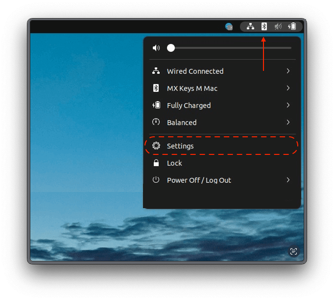
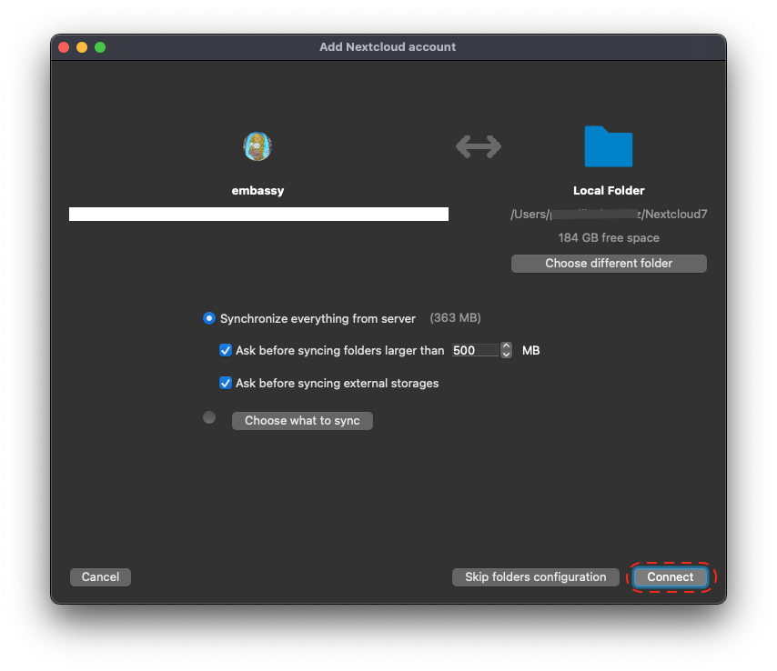
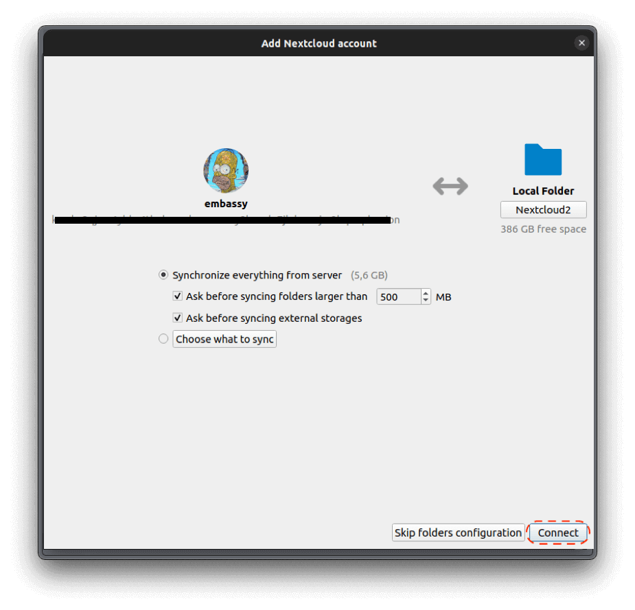

# Nextcloud - Linux 


## Initial Config

It is advised to setup your Nextcloud devices on LAN (if available) for the best experience.  Once set up, Tor can be used for remote syncing, but remember that large files will likely fail or take a very long time, so it is best to use remote sync only for low-bandwidth activity, such as Calendar, Contacts, Tasks, and Notes.  Streaming your music is also possible.  Later in 2023, new connection options will unlock Nextcloud's full feature-set.

## Desktop Integrations

Many Linux distributions ship with a Desktop Environment (DE) that supports Nextcloud account integration directly for use with their built-in calendars and other applications.  It is recommended to try these first for the best possible experience with your particular flavor of Linux.

You will first need to [trust your Root CA](device-guides/linux/ca.md).

The following desktop environments support integrated account syncing, including Nextcloud:

- Gnome (Ubuntu default)
- Cinnamon (Linux Mint default)
- KDE
- Budgie

The following guide uses Ubuntu as an example.

1. Open settings app.

    

    
1. Go to Online Accounts and click on **Nextcloud**.

    


1. Paste in the server path from **StartOS > Nextcloud > Interfaces** and the username and password from **StartOS > Nextcloud > Properties**, and click **Connect**.

    


1. Choose which services you want to integrate and close **Nextcloud Account** window.

    


1. Open the file manager, and you should see your NextCloud account in the side panel.

    


To setup other Linux distributions, check out this [Linuxhint guide](https://linuxhint.com/linux_file_managers_nextcloud/) and our [Nextcloud Master Thread](https://community.start9.com/t/nextcloud-master-thread/).  Please share your feedback - it is very valuable to our community!

## Standalone Clients

For those that prefer to use a desktop client or your desktop environment does not support account integrations.

```admonish note

The desktop version of NextCloud doesn't have much of a user interface.  Once installed, it solely lives in the your system tray or navigation bar.  You can click on this icon to access the app.

```

## File Syncing - Nextcloud Desktop

This is Nextcloud's official client application for file syncing and account management.  It is available in your favorite package manager (usually as `nextcloud`).  You can also see this [full list of available packages](https://help.nextcloud.com/t/linux-packages-status/).   or you can get the latest version as an AppImage from the [Download for Desktop](https://nextcloud.com/install/#install-clients) section of Nextcloud's website.


## LAN Setup

Make sure you have first set up your [trusted Root CA](/device-guides/linux/ca.md).

1. Open the client and click **Log In to your Nextcloud**.

    


1. From your server's Nextcloud Service page, go to **Interfaces** and copy the LAN address.

    
 

1. Enter your LAN address under **Server Address** and click **Next**.

    


1. This will launch a page in your web browser, click **Log In** and then **Grant access** to link the desktop client. You can close this browser window afterwards.

    


1. Next, configure the local directory that you want to sync with Nextcloud. You may use the default or change it, and edit the sync settings to desired. When satisfied, click **Connect**.

    


1. Files will begin to sync immediately and you will see a green check when this is complete.

    


1.  That's it! From this desktop client you will recieve notifications, control accounts and syncing, and quickly access your Apps' WebUI pages

## Tor Setup

You will first need to have the [Tor daemon running](/device-guides/linux/tor.md).

1. On your desktop application. Click the account avatar in the top left > Settings, then click Network. Choose **Specify proxy manually as** and **SOCKS5 proxy**. Enter **127.0.0.1** for the Host and **9050** for the port.

    


1. Close the Settings screen and click the account in the top left again, then **Add Account**.

    


1. On the following screen, click **Log in your Nextcloud**, then enter your Nextcloud Tor server address, which you can copy from the Nextcloud page on your **StartOS > Interfaces > Tor**.  This should start with ``https://`` and end with ``.onion``.

    


    


1. This will launch your browser and prompt you to log in to your account. Log in and then grant access as we did for LAN.
1. That's it! You can set up some select folders for remote sync, but for large files, it is best to sync on LAN only. Check your connection by clicking the newly created account in the client app.