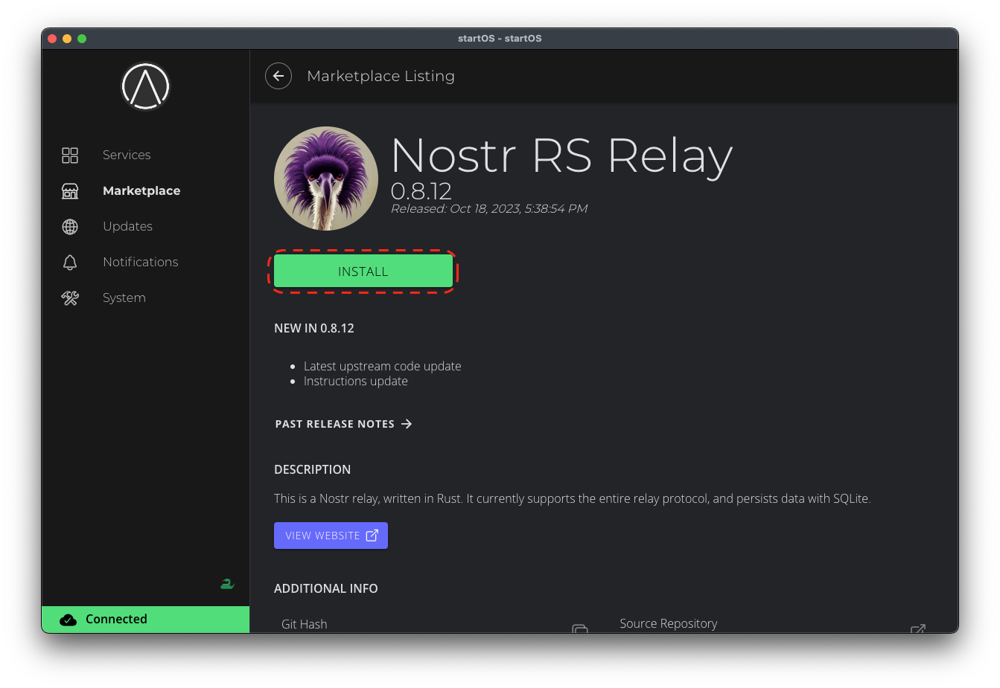

# Nostr RS Relay


Nostr is a simple, open protocol that enables global, decentralized, and censorship-resistant social media. 

```admonish note

It is highly recommended that you run a private relay, not a public one. Private will be the default option when you open the config for the first time. You will not be able to save the config until you follow the instructions below.

```

## Initial Config

1. Install **Nostr RS relay** service from Start9 Registry on your server.

    


1. In the service, page click **CONFIGURE** and add the pubkey in hex format to whitelist your client. Click save.
 
    


1. Now you will have a Nostr relay websocket URL available in Nostr RS Relay -> Properties.


## Running a private relay

Private relays serve as a personal backup for your posts, follows, messages, settings, and more. Without a private relay, there is no assurance that this data will be preserved, and there is a risk of it disappearing unexpectedly. By utilizing a private relay, only the pubkeys on the whitelist are authorized to post and save content to your relay. To ensure functionality, it is essential to whitelist your own pubkey in hex format. The configuration settings will not permit saving until at least one pubkey is added to the whitelist. Some Nostr clients may offer the option to copy your hex pubkey, but if not, you can visit [https://damus.io/key](https://damus.io/key) to convert your npub to hex.


## Running a public relay

In contrast to a private relay, a public relay lacks a whitelist, permitting any pubkey to post. Running a public relay is not recommended unless you comprehend the associated risks and configure it with appropriate safeguards. The primary risk to be mindful of is the potential for malicious clients to spam your relay, leading to the saturation of your storage drive. While we have implemented fairly restrictive defaults in your configuration to mitigate this risk, it is crucial to acknowledge that you assume responsibility for managing this aspect on your own.


## Testing your relay

If you want to test your private relay and verify whether it's storing all your notes, you can SSH into your server and execute the following command.

```
sudo podman exec nostr.embassy sqlite3 /data/nostr.db "SELECT content FROM event;" | grep -o 'content":"[^"]*' | awk -F: '{print $1":"$2}'
```
