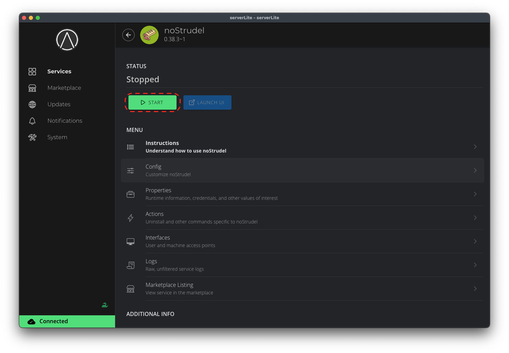
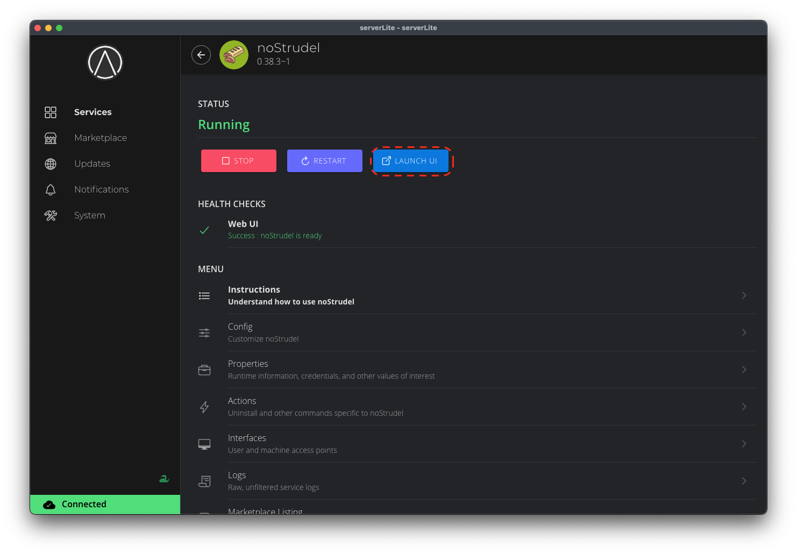
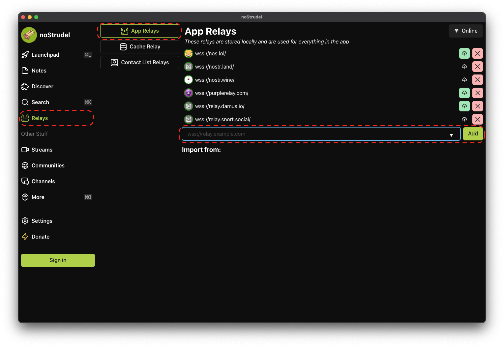
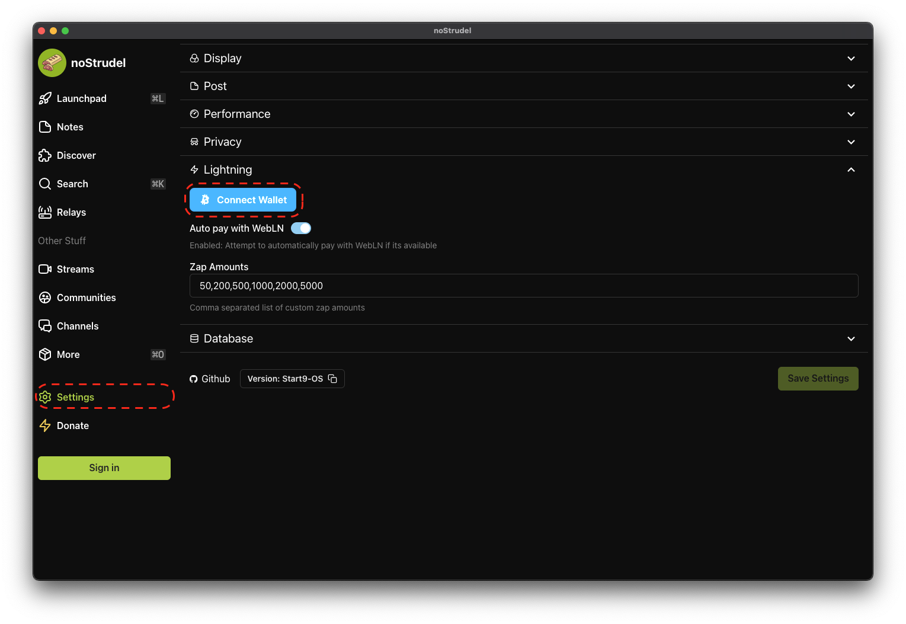

# noStrudel

noStrudel is a nostr web client that is focused on exploring the nostr network. The focus is on power users or any other users who want to learn the inner workings of nostr. 

## Using noStrudel on StartOS

1. Install the noStrudel service from the Start9 registry on your server.

   

1. Click "Start".

   

1. When the service is ready click "Launch UI" to access noStrudel.

   

1. Choose how to setup your relays and create a new account or access an existing account by using a nip-07 browser extension. If creating a new account, be sure to securely back up the private key, preferably using Vaultwarden on StartOS.

   

1. To connect to your own private relay, go to Relays -> App Relays, paste in your Nostr Relay Websocket URL (e.g. ws://address.onion) and click add. You can find this value in the Properties section of your Nostr RS Relay service.

   ```admonish note

   If you plan to connect to your own private relay, you must use either be running your own [LAN/Router VPN](/user-manual/connecting-remotely/router-vpn.md) or you must use [Tor browser](https://www.torproject.org/) on your system.  We recommend using Firefox which must be [configured to use Tor](/misc-guides/firefox-guides/tor.md).

   ```

   

1. To connect to your LND instance using [NWC](https://marketplace.start9.com/marketplace/nostr-wallet-connect) (Nostr Wallet Connect) for LN payments, go to Settings -> Lightning -> Connect wallet. Choose NWC and paste your pairing secret.

   
