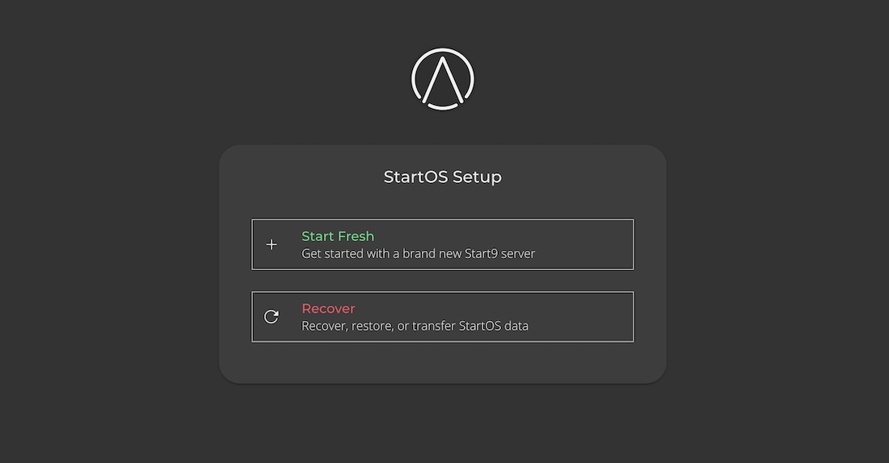
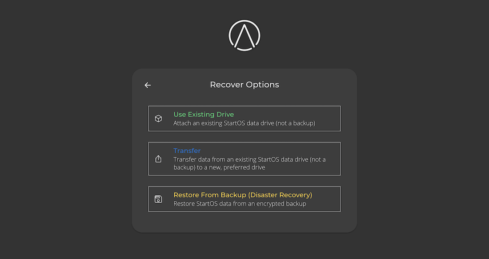

# Initial Setup

#### Contents

- [Start Fresh](#start-fresh)
- [Recover](#recover)

## Start Fresh

1. Connect your server to power and Ethernet.

1. From a computer connected to the same Local Area Network (LAN) as your server, open a browser and visit <a href="http://start.local" target="_blank">http://start.local</a>.

   

1. Select "Start Fresh" and follow the on-screen instructions. If you are setting up StartOS and need to recover existing data, see [Initial Setup - Recover](./recover.md).

## Recover

There are three options for setting up StartOS while also keeping existing data.

- [Use Existing Drive](#use-existing-drive)
- [Transfer](#transfer)
- [Restore from Backup (Disaster Recovery)](#restore-from-backup-disaster-recovery)

### Use Existing Drive

Select this option if:

1. You have re-flashed StartOS and want to resumt normal operation on the same drive and server.

1. You are physically transplanting your data drive to a new server.

### Transfer

Select this option if you are transferring your data from one drive to another.

### Restore from Backup (Disaster Recovery)

Select this option _only_ if your StartOS data drive has been lost or corrupted. This is for disaster recovery only.
